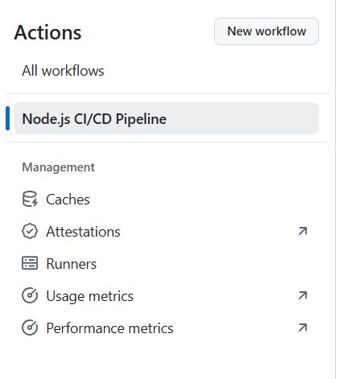
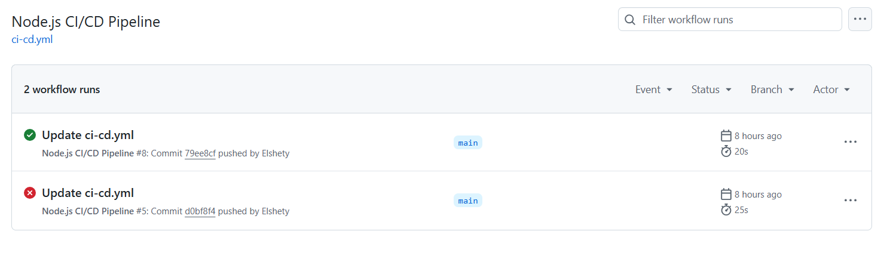

# Activity: Setting Up Cloud Monitoring for CI/CD Workflows

## Introduction

This guide covers logging and alerting implementation for GitHub Actions workflows. It demonstrates how to enhance visibility through structured logging and configure real-time notifications for workflow events. Learn to leverage native GitHub logs, external log storage (AWS CloudWatch), and multi-channel alerting (Slack/Email) for effective CI/CD monitoring.

---

## Learning Outcomes

By implementing these techniques, you will:

1. Access and interpret GitHub Actions' native execution logs  
2. Implement structured logging with custom formatting commands  
3. Configure external log storage in AWS CloudWatch for long-term retention  
4. Set up real-time alerts via Slack and email for workflow failures  
5. Apply best practices for log organization and alert optimization  


---

## Starter Files
No pre-existing files are required. You will build everything from scratch during the activity.

---

## Part 1: Logging Implementation

### 1.1 Accessing Native GitHub Actions Logs

GitHub Actions automatically generates execution logs for all workflow runs. These logs provide:

- Command execution details
- Step completion status
- Error messages and stack traces
- Performance timing metrics

**Access Procedure:**

1. Navigate to the GitHub repository  
2. Select the "Actions" tab  


3. Choose the relevant workflow  




4. Click on the specific run to view detailed logs  





### 1.2 Enhanced Logging Techniques

#### Custom Log Formatting

GitHub supports structured log commands:

```yaml
steps:
  - name: Execute build process
    run: |
      echo "::group::Dependency Installation"
      echo "::notice::Initializing package installation"
      npm install
      echo "::warning::Detected outdated dependency"
      echo "::endgroup::"
```

**Log Command Reference:**

- `::notice::` Highlights informational messages
- `::warning::` Indicates non-critical issues
- `::error::` Flags critical failures
- `::group::` Creates collapsible log sections

#### External Log Storage (AWS CloudWatch)

For long-term log retention and analysis:

```yaml
- name: Archive logs to CloudWatch
  run: |
    echo "Workflow execution started at $(date)" > workflow.log
    aws logs put-log-events \
      --log-group-name "github-actions" \
      --log-stream-name "${{ github.run_id }}" \
      --log-events file://workflow.log
  env:
    AWS_ACCESS_KEY_ID: ${{ secrets.AWS_ACCESS_KEY_ID }}
    AWS_SECRET_ACCESS_KEY: ${{ secrets.AWS_SECRET_ACCESS_KEY }}
```

---

## Part 2: Alerting Configuration

### 2.1 Slack Notification Setup

**Implementation Steps:**

1. Generate Slack webhook URL  
2. Store as GitHub secret (`SLACK_WEBHOOK_URL`)  
3. Configure workflow:  

```yaml
- name: Slack Failure Notification
  if: failure()
  uses: slackapi/slack-github-action@v1
  with:
    slack-message: |
      Workflow Failure Alert
      Workflow: ${{ github.workflow }}
      Repository: ${{ github.repository }}
      Commit: ${GITHUB_SHA:0:7}
      Details: https://github.com/${{ github.repository }}/actions/runs/${{ github.run_id }}
  env:
    SLACK_WEBHOOK_URL: ${{ secrets.SLACK_WEBHOOK_URL }}
```

### 2.2 Email Notification Setup

**Implementation Steps:**

1. Configure email credentials as secrets:
   - `EMAIL_USER`
   - `EMAIL_PASSWORD` (app-specific)
2. Add to workflow:

```yaml
- name: Email Failure Notification
  if: failure()
  uses: dawidd6/action-send-mail@v3
  with:
    server_address: smtp.gmail.com
    username: ${{ secrets.EMAIL_USER }}
    password: ${{ secrets.EMAIL_PASSWORD }}
    subject: "Workflow Failure: ${{ github.workflow }}"
    to: operations-team@organization.com
```

---

## Implementation Best Practices

### Log Management

- Organize related operations into logical groups  
- Include timestamps for critical operations:

```bash
echo "[$(date +%Y-%m-%dT%H:%M:%S)] Starting deployment sequence"
```

- Implement log rotation for external storage  

### Alert Optimization

- Route alerts by severity level  
- Include relevant context in notifications:
  - Workflow name  
  - Repository  
  - Commit reference  
  - Direct link to failed run  

### Retention Policies

- GitHub native logs: 90 days retention  
- CloudWatch logs: Configure retention period (1 day - 10 years)  
- S3 archival: For compliance requirements  

---

## Conclusion

Logging and alerting are essential for ensuring automation reliability. By structuring logs effectively and integrating alerting mechanisms, teams can proactively detect and resolve issues. Implementing these strategies improves workflow transparency, reduces downtime, and enhances deployment efficiency, aligning with best practices in DevOps and cloud automation.
