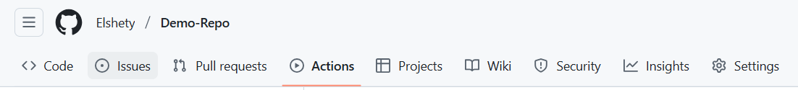

# Activity: Setting Up Cloud Monitoring for CI/CD Workflows

## Introduction

This guide covers logging and alerting implementation for GitHub Actions workflows. It demonstrates how to enhance visibility through structured logging and configure real-time notifications for workflow events. Learn to leverage native GitHub logs, external log storage (AWS CloudWatch), and multi-channel alerting (Slack/Email) for effective CI/CD monitoring.

---

## Learning Outcomes

By implementing these techniques, you will:

1. Access and interpret GitHub Actions' native execution logs  
2. Implement structured logging with custom formatting commands  
3. Configure external log storage in AWS CloudWatch for long-term retention  
4. Set up real-time alerts via Slack and email for workflow failures  
5. Apply best practices for log organization and alert optimization  


---

## Starter Files
No pre-existing files are required. You will build everything from scratch during the activity.

---


## 1. Enhanced Logging in GitHub Actions
GitHub Actions supports structured logging commands for better workflow debugging.

### 1.1 Custom Log Formatting
GitHub provides special commands (`::notice::`, `::warning::`, `::error::`, `::group::`) to format logs.

### Step-by-Step Implementation

#### Create/Edit a GitHub Actions Workflow
1. Go to your **GitHub repository**.




2. Navigate to `.github/workflows/` and create/edit a YAML file (e.g., `logging-demo.yml`).


#### Use Logging Commands

```yaml
name: Enhanced Logging Demo
on: [push]

jobs:
  logging-demo:
    runs-on: ubuntu-latest
    steps:
      - name: Execute build process
        run: |
          echo "::group::Dependency Installation"
          echo "::notice::Initializing package installation"
          npm install
          echo "::warning::Detected outdated dependency"
          echo "::endgroup::"
```

- `::group::` & `::endgroup::` → Creates a collapsible log section.
- `::notice::` → Highlights an informational message.
- `::warning::` → Indicates a non-critical issue (yellow highlight).
- `::error::` → Flags a critical failure (red highlight).

#### Run the Workflow
1. Commit & push changes.
2. Go to **Actions** tab → Check logs.


## 2. External Log Storage (AWS CloudWatch)
For long-term log retention, you can send logs to AWS CloudWatch.

### Prerequisites
- AWS Account (Free Tier available)
- AWS IAM User with `logs:PutLogEvents` permissions
- AWS Credentials stored in GitHub Secrets

### Step-by-Step Setup

#### Step 1: Configure AWS IAM Permissions
1. Go to **AWS IAM Console** → **Users** → **Add User**.
2. Attach the following policy:

```json
{
    "Version": "2012-10-17",
    "Statement": [{
        "Effect": "Allow",
        "Action": ["logs:PutLogEvents", "logs:CreateLogStream"],
        "Resource": "*"
    }]
}
```

3. Generate **Access Key** & **Secret Key**.

#### Step 2: Store AWS Credentials in GitHub Secrets
1. Go to **GitHub Repo** → **Settings** → **Secrets** → **Actions** → **New Repository Secret**.
2. Add:
   - `AWS_ACCESS_KEY_ID` (from IAM user)
   - `AWS_SECRET_ACCESS_KEY`

#### Step 3: Modify GitHub Actions Workflow

```yaml
name: CloudWatch Logging Demo
on: [push]

jobs:
  cloudwatch-logging:
    runs-on: ubuntu-latest
    steps:
      - name: Archive logs to CloudWatch
        run: |
          echo "Workflow execution started at $(date)" > workflow.log
          echo "Additional logs here..." >> workflow.log
          
          # Send logs to AWS CloudWatch
          aws logs create-log-group --log-group-name "github-actions" || true
          aws logs create-log-stream --log-group-name "github-actions" --log-stream-name "${{ github.run_id }}" || true
          aws logs put-log-events \
            --log-group-name "github-actions" \
            --log-stream-name "${{ github.run_id }}" \
            --log-events file://workflow.log
        env:
          AWS_ACCESS_KEY_ID: ${{ secrets.AWS_ACCESS_KEY_ID }}
          AWS_SECRET_ACCESS_KEY: ${{ secrets.AWS_SECRET_ACCESS_KEY }}
          AWS_REGION: us-east-1  # Change to your region
```

#### Step 4: Verify Logs in AWS CloudWatch
1. Go to **AWS CloudWatch Console**.
2. Navigate to **Logs** → **Log Groups** → `github-actions`.
3. Check logs under the **Run ID stream**.


---

## Part 2: Alerting Configuration

### 2.1 Slack Notification Setup

**Implementation Steps:**

1. Generate Slack webhook URL  
2. Store as GitHub secret (`SLACK_WEBHOOK_URL`)  
3. Configure workflow:  

```yaml
- name: Slack Failure Notification
  if: failure()
  uses: slackapi/slack-github-action@v1
  with:
    slack-message: |
      Workflow Failure Alert
      Workflow: ${{ github.workflow }}
      Repository: ${{ github.repository }}
      Commit: ${GITHUB_SHA:0:7}
      Details: https://github.com/${{ github.repository }}/actions/runs/${{ github.run_id }}
  env:
    SLACK_WEBHOOK_URL: ${{ secrets.SLACK_WEBHOOK_URL }}
```

### 2.2 Email Notification Setup

**Implementation Steps:**

1. Configure email credentials as secrets:
   - `EMAIL_USER`
   - `EMAIL_PASSWORD` (app-specific)
2. Add to workflow:

```yaml
- name: Email Failure Notification
  if: failure()
  uses: dawidd6/action-send-mail@v3
  with:
    server_address: smtp.gmail.com
    username: ${{ secrets.EMAIL_USER }}
    password: ${{ secrets.EMAIL_PASSWORD }}
    subject: "Workflow Failure: ${{ github.workflow }}"
    to: operations-team@organization.com
```

---

## Implementation Best Practices

### Log Management

- Organize related operations into logical groups  
- Include timestamps for critical operations:

```bash
echo "[$(date +%Y-%m-%dT%H:%M:%S)] Starting deployment sequence"
```

- Implement log rotation for external storage  

### Alert Optimization

- Route alerts by severity level  
- Include relevant context in notifications:
  - Workflow name  
  - Repository  
  - Commit reference  
  - Direct link to failed run  

### Retention Policies

- GitHub native logs: 90 days retention  
- CloudWatch logs: Configure retention period (1 day - 10 years)  
- S3 archival: For compliance requirements  

---

## Conclusion

Logging and alerting are essential for ensuring automation reliability. By structuring logs effectively and integrating alerting mechanisms, teams can proactively detect and resolve issues. Implementing these strategies improves workflow transparency, reduces downtime, and enhances deployment efficiency, aligning with best practices in DevOps and cloud automation.
