# Activity: CI/CD Pipeline for React + Node.js 

## Introduction
Deploying a full-stack cloud application requires integrating frontend, backend, cloud infrastructure, and automation. This guide provides a step-by-step approach to setting up a version-controlled project, developing both frontend and backend, configuring cloud infrastructure with Pulumi, and automating deployment using GitHub Actions.

---

## Learning Outcomes
By completing this activity, you will:
1. Set up a GitHub repository for version control.
2. Develop a React frontend and Node.js/Express backend.
3. Configure Pulumi to define and deploy AWS infrastructure (S3 bucket for frontend, API endpoints).
4. Automate deployments using GitHub Actions for CI/CD.
5. Verify and access the live application in the cloud.

---

## Starter Files
No pre-existing files are required. You will build everything from scratch during the activity. However you can use the attached starter files:
1. Frontend (React)
2. Backend (Node.js + Express)

---

# Building and Deploying a Full-Stack Cloud Application

## Step 1: Set Up GitHub Repository
**Objective:** Create a version-controlled project foundation.

### Instructions:
1. Go to GitHub and create a new repository named `fullstack-cloud-app`.
   

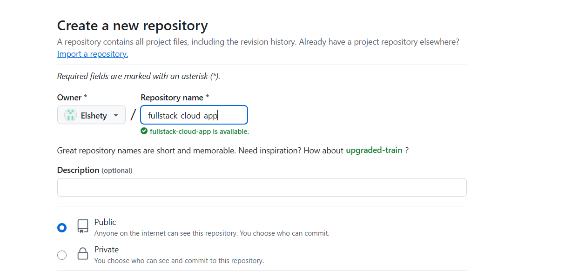


2. Clone it locally:
   ```bash
   git clone https://github.com/YOUR_USERNAME/fullstack-cloud-app.git
   cd fullstack-cloud-app
   ```


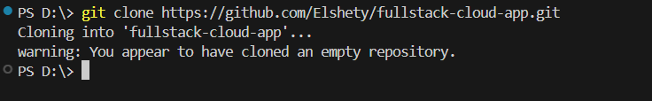


---

## Step 2: Create the Frontend (React)
**Objective:** Set up a modern React frontend.

### Instructions:
1. Initialize a React app:
   ```bash
   npx create-react-app frontend
   ```


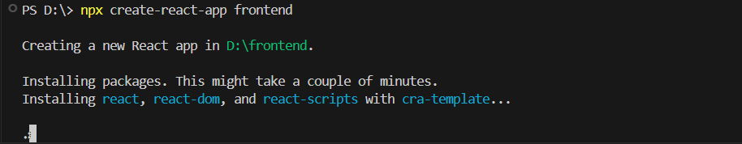


2. Start the development server:
   ```bash
   cd frontend
   npm start
   ```

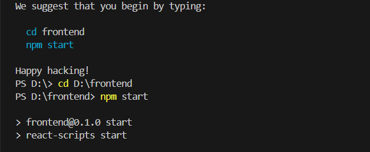


3. Verify React runs at `http://localhost:3000`.


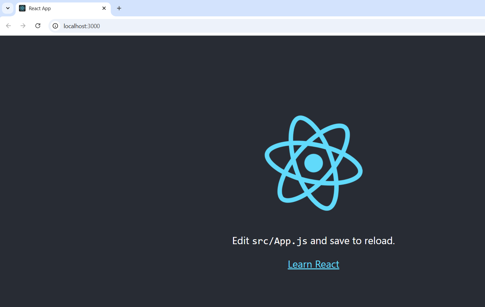


---

## Step 3: Create the Backend (Node.js + Express)
**Objective:** Build a robust backend API.

### Instructions:
1. From project root, create backend:
   ```bash
   mkdir backend && cd backend
   ```

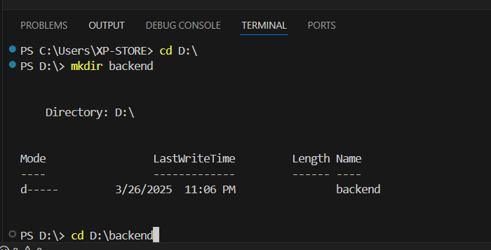


2. Initialize project:
   ```bash
   npm init -y
   ```

3. Install dependencies:
   ```bash
   npm install express cors dotenv pg
   ```

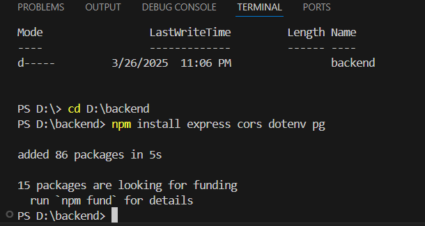


4. Create `server.js`:
   ```javascript
   const express = require("express");
   const app = express();
   const cors = require("cors");

   app.use(cors());
   app.use(express.json());

   app.get("/", (req, res) => {
       res.send("Backend is running!");
   });

   const PORT = process.env.PORT || 5000;
   app.listen(PORT, () => console.log(`Server running on port ${PORT}`));
   ```


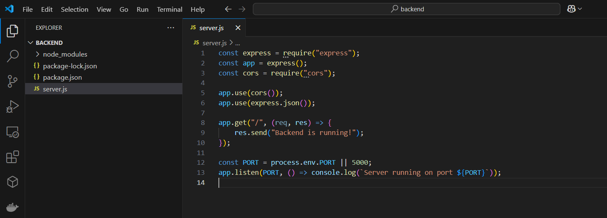


5. Start the server:
   ```bash
   node server.js
   ```

6. Verify at `http://localhost:5000`.


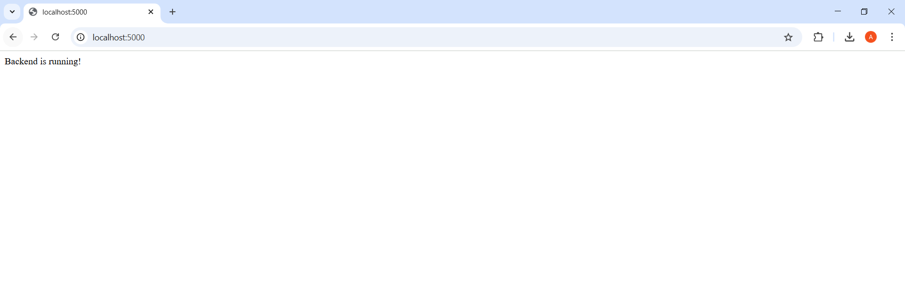


---

## Step 4: Prepare for Deployment
**Objective:** Configure cloud infrastructure.

### Install Pulumi for Your Cloud (AWS Example):
```bash
pulumi new aws-typescript
```

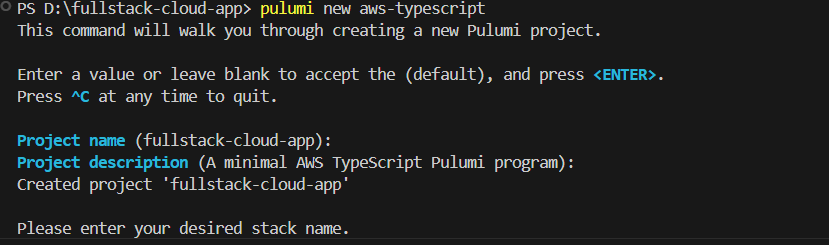


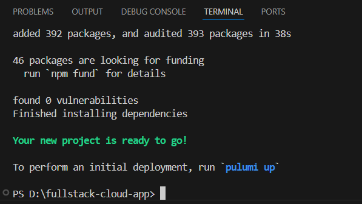


---

## Step 5: Write Pulumi Infrastructure Code
**Objective:** Define cloud resources as code.

### Instructions:
1. In `backend/`, create `index.ts`:
   ```typescript
   import * as pulumi from "@pulumi/pulumi";
   import * as aws from "@pulumi/aws";

   const bucket = new aws.s3.Bucket("react-app-bucket", {
       website: {
           indexDocument: "index.html"
       }
   });

   // Allow public read access
   new aws.s3.BucketPolicy("bucketPolicy", {
       bucket: bucket.id,
       policy: bucket.id.apply(id => JSON.stringify({
           Version: "2012-10-17",
           Statement: [{
               Effect: "Allow",
               Principal: "*",
               Action: ["s3:GetObject"],
               Resource: [`arn:aws:s3:::${id}/*`]
           }]
       }))
   });

   export const bucketName = bucket.id;
   export const bucketEndpoint = pulumi.interpolate`http://${bucket.websiteEndpoint}`;
   ```

2. Deploy:
   ```bash
   pulumi up
   ```


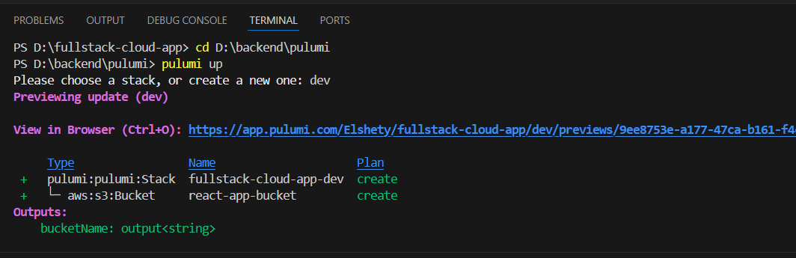


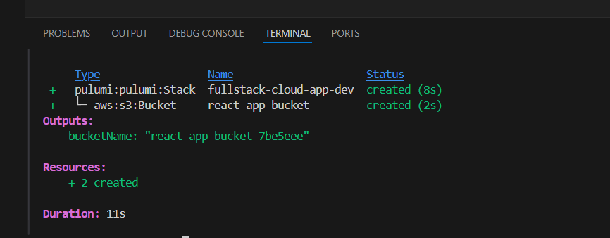


---

## Step 6: Set Up GitHub Actions CI/CD
**Objective:** Automate deployment on code changes.

### Instructions:
1. Create `.github/workflows/deploy.yml`:
   ```yaml
   name: Deploy Full-Stack App

   on:
     push:
       branches: [ main ]

   jobs:
     deploy:
       runs-on: ubuntu-latest
       steps:
         - uses: actions/checkout@v3
         
         - name: Set up Node.js
           uses: actions/setup-node@v3
           with:
             node-version: '18'
             
         - name: Install dependencies
           run: npm install
           
         - name: Install Pulumi
           uses: pulumi/actions@v4
           
         - name: Configure AWS Credentials
           uses: aws-actions/configure-aws-credentials@v1
           with:
             aws-access-key-id: ${{ secrets.AWS_ACCESS_KEY_ID }}
             aws-secret-access-key: ${{ secrets.AWS_SECRET_ACCESS_KEY }}
             aws-region: us-east-1
             
         - name: Deploy with Pulumi
           run: pulumi up --yes --stack dev
   ```

2. Commit changes:
   ```bash
   git add .
   git commit -m "Set up CI/CD"
   git push origin main
   ```

---

## Conclusion
Building and deploying a full-stack cloud application involves multiple steps, from local development to cloud hosting. By automating infrastructure and deployment, you ensure reliability, scalability, and efficient CI/CD workflows. Implementing these practices enhances software delivery, reduces manual errors, and optimizes cloud resource utilization.
