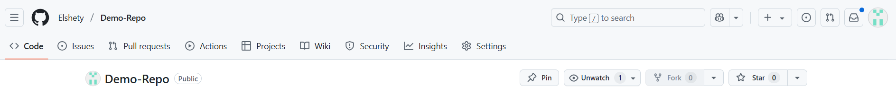
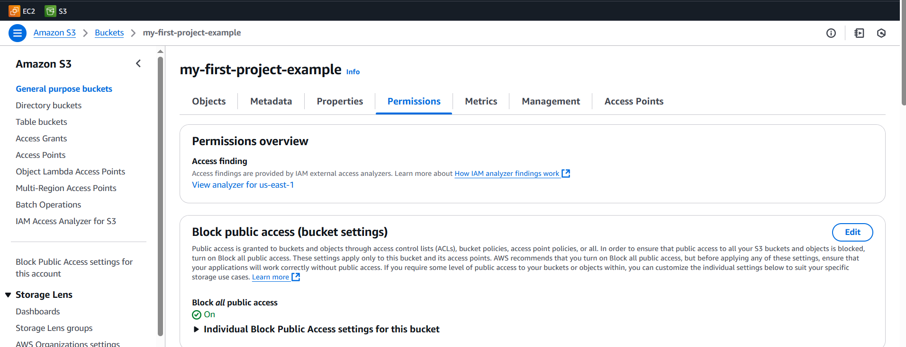

# Activity: Setting Up a CI/CD Pipeline for Node.js App

## Introduction
In this activity, students will learn how to set up a Continuous Integration and Continuous Deployment (CI/CD) pipeline for a Node.js application using GitHub Actions and AWS S3. By the end, they will have a working pipeline that automatically builds, tests, and deploys their app whenever changes are pushed to the main branch.

## Learning Outcomes
By completing this activity, students will:
1. Set up a basic Node.js app with Express and initialize a Git repository.
2. Configure GitHub Actions to automate testing and deployment.
3. Create and secure an AWS S3 bucket for static web hosting.
4. Deploy the application automatically using GitHub Actions workflows.
5. Monitor and verify successful deployments via AWS S3.

---

## Starter Files
No pre-existing files are required. You will build everything from scratch during the activity.

---


## Step 1: Set Up Your Node.js Application
### Objective: Create a basic Node.js app with Express.
### Instructions:
1. Open your terminal (Mac/Linux) or Command Prompt/PowerShell (Windows).
2. Run the following commands:

```bash
# Create a new project directory
mkdir Demo-Repo
cd Demo-Repo

# Initialize a Node.js project (accept default settings)
npm init -y

# Install Express (web framework)
npm install express

# Create the main server file
touch app.js
```


3. Open `app.js` in a code editor (e.g., VS Code) and paste the following:

```javascript
const express = require('express');
const app = express();
const PORT = process.env.PORT || 3000;

app.get('/', (req, res) => {
  res.send('Hello from our CI/CD pipeline!');
});

app.listen(PORT, () => {
  console.log(`Server running on port ${PORT}`);
});
```


4. Test the app locally:

```bash
node app.js
```

- Open a browser and visit [http://localhost:3000](http://localhost:3000).
- You should see: "Hello from our CI/CD pipeline!"


---

## Step 2: Initialize a Git Repository
### Objective: Set up version control for the project.
### Instructions:

```bash
# Initialize Git
git init

# Create a .gitignore file to exclude node_modules and .env files
echo "node_modules/" >> .gitignore
echo ".env" >> .gitignore

# Add all files to Git and commit
git add .
git commit -m "Initial commit"
```


---

## Step 3: Create a GitHub Repository
### Objective: Push the code to GitHub.
### Instructions:
1. Go to GitHub and log in.
2. Click "New repository".
   - Name: `Demo-Repo`
   - Leave other settings as default.





3. After creation, GitHub will provide a remote URL (e.g., `https://github.com/yourusername/Demo-Repo.git`).
4. In your terminal, run:

```bash
git remote add origin <your-github-repo-url>
git branch -M main
git push -u origin main
```

5. Refresh GitHub—your code should now be uploaded.


---

## Step 4: Set Up an AWS S3 Bucket
### Objective: Create an S3 bucket to host the app.
### Instructions:

1. **Go to AWS Management Console**:
   - Open your browser and navigate to the AWS Management Console.


2. **Sign in with Your Credentials**:
   - Enter your AWS credentials (email and password) to log in.


3. **Get to the Home Page**:
   - Once logged in, you’ll be redirected to the AWS Management Console home page.


---

## 3. Navigate to S3
1. **Search for S3**:
   - In the AWS Management Console, search for "S3" in the services search bar and select it.


---

## 4. Create a Bucket
1. **Click Create Bucket**:
   - On the S3 dashboard, click the Create bucket button.


2. **Enter Bucket Name**:
   - Enter a unique bucket name (e.g., my-first-project-example).


3. **Choose Region**:
   - Select the region closest to you or your target audience.


4. **Create the Bucket**:
   - Leave all other settings as default and click Create bucket.


---

## 5. Enable Static Website Hosting
1. **Enable Static Website Hosting**:
   - In your bucket, go to the Properties tab.


    - Scroll down to the Static website hosting section.


    - Click Edit.
   - Select Enable.

 


   - Set the Index document to index.html.
   - Leave the Error document field blank (unless you have a custom error page).


    - Click Save changes.
  
   


---

## 6. Make the Bucket Public
1. **Disable Block Public Access**:
   - In the Permissions tab, scroll down to Block public access (bucket settings).





    - Click Edit.
   - Uncheck Block all public access.


   - Confirm by typing "confirm" in the box.

 


   - Click Save changes.


---

## Step 5: Configure AWS IAM User for GitHub Actions
### Objective: Create a secure AWS user for GitHub to deploy to S3.
### Instructions:
1. In AWS, search for "IAM" (Identity and Access Management).
2. Go to "Users" > "Add user".
   - Username: `github-actions-user`
   - Access type: Select "Programmatic access".
3. Click "Next: Permissions".
   - Select "Attach existing policies directly".
   - Search for `AmazonS3FullAccess` and select it.
4. Click "Next: Tags" (optional), then "Next: Review".
5. Click "Create user".
6. **Important**: Copy the Access Key ID and Secret Access Key (you won’t see them again).

---

## Step 6: Set Up GitHub Secrets
### Objective: Store AWS credentials securely in GitHub.
### Instructions:
1. Go to your GitHub repository.
2. Click "Settings" > "Secrets and variables" > "Actions".
3. Click "New repository secret" and add:
   - Name: `AWS_ACCESS_KEY_ID`   
     Value: (paste the AWS Access Key from Step 5)
   - Name: `AWS_SECRET_ACCESS_KEY`   
     Value: (paste the AWS Secret Key from Step 5)
   - Name: `AWS_REGION`   
     Value: (e.g., `us-east-1`)
   - Name: `S3_BUCKET_NAME`   
     Value: (your S3 bucket name, e.g., `yourname-nodejs-app`)


---

## Step 7: Create GitHub Actions Workflow
### Objective: Automate testing and deployment.
### Instructions:

```bash
mkdir -p .github/workflows
touch .github/workflows/ci-cd.yml
```

Open `ci-cd.yml` and paste:

```yaml
name: Node.js CI/CD Pipeline

on:
  push:
    branches: [ "main" ]
  pull_request:
    branches: [ "main" ]

env:
  AWS_REGION: ${{ secrets.AWS_REGION }}
  S3_BUCKET: ${{ secrets.S3_BUCKET_NAME }}

jobs:
  build-and-test:
    runs-on: ubuntu-latest
    
    steps:
    - uses: actions/checkout@v3
    
    - name: Set up Node.js
      uses: actions/setup-node@v3
      with:
        node-version: '18'
    
    - name: Install dependencies
      run: npm install
    
    - name: Run tests
      run: npm test  # Add tests later

  deploy:
    needs: build-and-test
    runs-on: ubuntu-latest
    
    steps:
    - uses: actions/checkout@v3
    
    - name: Set up Node.js
      uses: actions/setup-node@v3
      with:
        node-version: '18'
    
    - name: Install dependencies
      run: npm install
    
    - name: Build application
      run: npm run build
    
    - name: Configure AWS credentials
      uses: aws-actions/configure-aws-credentials@v1
      with:
        aws-access-key-id: ${{ secrets.AWS_ACCESS_KEY_ID }}
        aws-secret-access-key: ${{ secrets.AWS_SECRET_ACCESS_KEY }}
        aws-region: ${{ secrets.AWS_REGION }}
    
    - name: Deploy to S3
      run: |
        sudo apt-get install -y awscli
        aws s3 sync ./build s3://${{ secrets.S3_BUCKET_NAME }} --delete
```


---

## Step 8: Update package.json for Build Script

**Objective:** Define a build script for deployment.

### Instructions:
1. Open `package.json` and update the scripts section:

```json
"scripts": {
  "start": "node app.js",
  "test": "echo \"Error: no test specified\" && exit 0",
  "build": "mkdir -p build && echo '<!DOCTYPE html><html><body><h1>Hello from S3</h1><script src=\"bundle.js\"></script></body></html>' > build/index.html && echo 'console.log(\"Hello from bundle.js\")' > build/bundle.js"
}
```


(This is a simple build—in a real project, use Webpack/Vite.)

---

## Step 9: Commit and Push Changes

**Objective:** Trigger the CI/CD pipeline.

### Instructions:

```bash
git add .
git commit -m "Add CI/CD workflow"
git push origin main
```

---

## Step 10: Monitor the Workflow

1. Go to your GitHub repo.
2. Click "Actions".
3. You should see the workflow running.
4. Wait for it to complete (~2-5 mins).


---

## Step 11: Verify Deployment

1. Go back to your AWS S3 bucket.
2. You should see `index.html` and `bundle.js` uploaded.
3. Go to **"Properties"** > **"Static website hosting"**.
4. Click the **Endpoint URL** to see your live website!
   - After enabling static website hosting, AWS will provide you with a Bucket website endpoint. Save this URL; you’ll use it to access your website.

   

5. Verification

   

---

## Conclusion

This hands-on exercise provides a foundational understanding of CI/CD pipelines using GitHub Actions and AWS S3. Students will gain practical experience in automating deployments, ensuring code reliability, and leveraging cloud services for hosting. The skills acquired can be extended to more complex projects with additional testing, security checks, and deployment strategies.
