# Activity: Creating Cloud Infrastructure with Pulumi

## Introduction
This activity demonstrates how to deploy an EC2 instance on AWS using Pulumi, an Infrastructure as Code (IaC) tool. Students will learn to define, provision, and manage cloud resources programmatically using JavaScript, gaining hands-on experience with Pulumi’s workflow and AWS integration.

---

## Learning Outcomes
By completing this activity, students will:
1. Set up a Pulumi project for AWS infrastructure automation.
2. Define an EC2 instance with security groups using Pulumi’s JavaScript SDK.
3. Deploy and manage infrastructure using Pulumi CLI (pulumi up, pulumi destroy).
4. Automate resource provisioning with configurable settings (AMI, instance type, security rules).
5. Verify and clean up deployments to optimize cost and resource management.

---

# Deploying an EC2 Instance with Pulumi on AWS

## Step 1: Set Up Your Pulumi Project
**Objective:** Initialize a Pulumi project for AWS infrastructure as code.

### Instructions:
1. Create a new directory for your project:

```bash
mkdir pulumi-ec2-demo && cd pulumi-ec2-demo
```

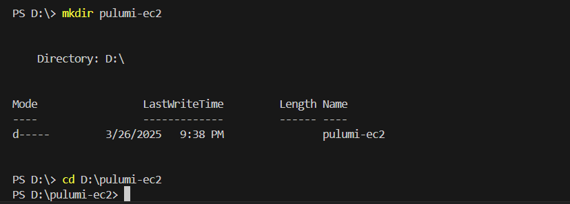


2. Initialize a new Pulumi project with JavaScript:

```bash
pulumi new aws-javascript
```

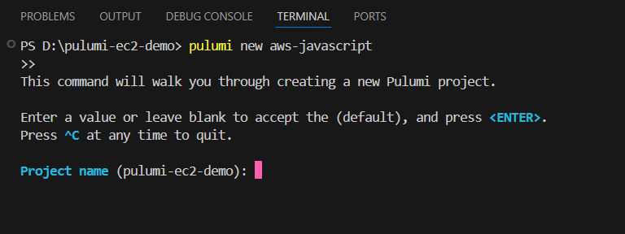


3. When prompted:
   - **Project name:** ec2-demo
   - **Stack name:** dev (or your preference)

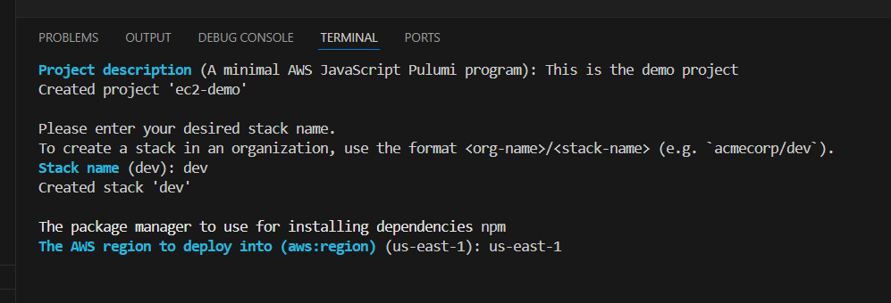


   - **AWS region:** Choose your preferred region (e.g., us-west-2)

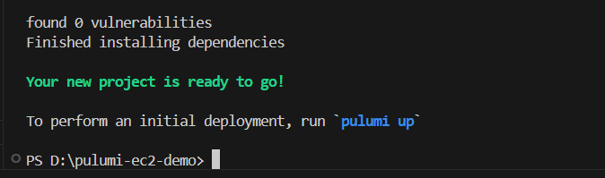


   This generates:
   - `index.js` (main deployment script)
   - `Pulumi.yaml` (project configuration)

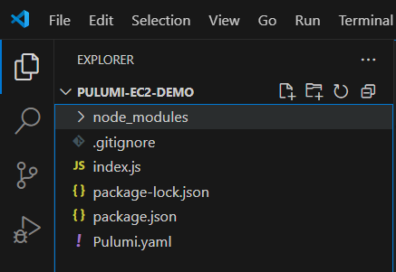


---

## Step 2: Write the EC2 Instance Deployment Script
**Objective:** Define infrastructure using Pulumi’s JavaScript SDK.

### Part 1: Import Required Packages
Open `index.js` and add:

```javascript
const aws = require("@pulumi/aws");
const pulumi = require("@pulumi/pulumi");
```

### Part 2: Configure AWS Settings

```javascript
// Get AWS configuration
const config = new pulumi.Config();
const awsConfig = new pulumi.Config("aws");
const region = awsConfig.require("region");

// Set instance type (default: t2.micro)
const instanceType = config.get("instanceType") || "t2.micro";
```

### Part 3: Create a Security Group

```javascript
// Security group allowing SSH/HTTP access
const secGroup = new aws.ec2.SecurityGroup("ec2-secgrp", {
    description: "Enable SSH and HTTP access",
    ingress: [
        { 
            protocol: "tcp", 
            fromPort: 22,  // SSH
            toPort: 22, 
            cidrBlocks: ["0.0.0.0/0"] 
        },
        { 
            protocol: "tcp", 
            fromPort: 80,  // HTTP
            toPort: 80, 
            cidrBlocks: ["0.0.0.0/0"] 
        },
    ],
    egress: [{
        protocol: "-1",  // Allow all outbound traffic
        fromPort: 0,
        toPort: 0,
        cidrBlocks: ["0.0.0.0/0"],
    }],
});
```

### Part 4: Create an EC2 Instance

```javascript
// Fetch the latest Amazon Linux 2 AMI
const ami = aws.ec2.getAmi({
    owners: ["amazon"],
    mostRecent: true,
    filters: [{
        name: "name",
        values: ["amzn2-ami-hvm-*-x86_64-ebs"],
    }],
}, { async: true });

// Deploy the EC2 instance
const server = new aws.ec2.Instance("web-server", {
    instanceType: instanceType,
    vpcSecurityGroupIds: [secGroup.id],
    ami: ami.then(ami => ami.id),
    tags: { Name: "web-server" },
    // keyName: "your-key-pair-name",  // Uncomment for SSH access
});

// Export instance details
exports.publicIp = server.publicIp;
exports.publicHostname = server.publicDns;
```

---

## Step 3: Deploy Your Infrastructure
**Objective:** Provision the EC2 instance using Pulumi.

### Instructions:
1. Preview the deployment (dry run):

```bash
pulumi preview
```

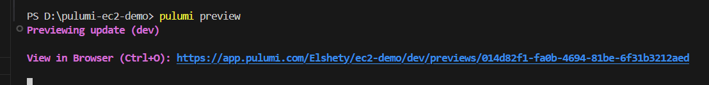


2. Deploy the infrastructure:

```bash
pulumi up
```

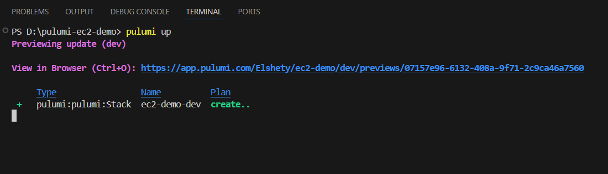


3. Confirm deployment by typing `yes` when prompted.

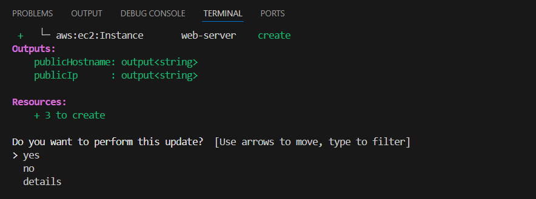


4. After completion, Pulumi outputs the EC2 instance’s public IP and hostname.

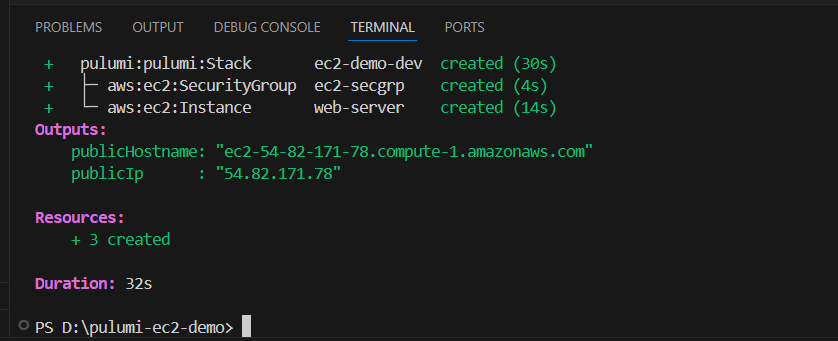


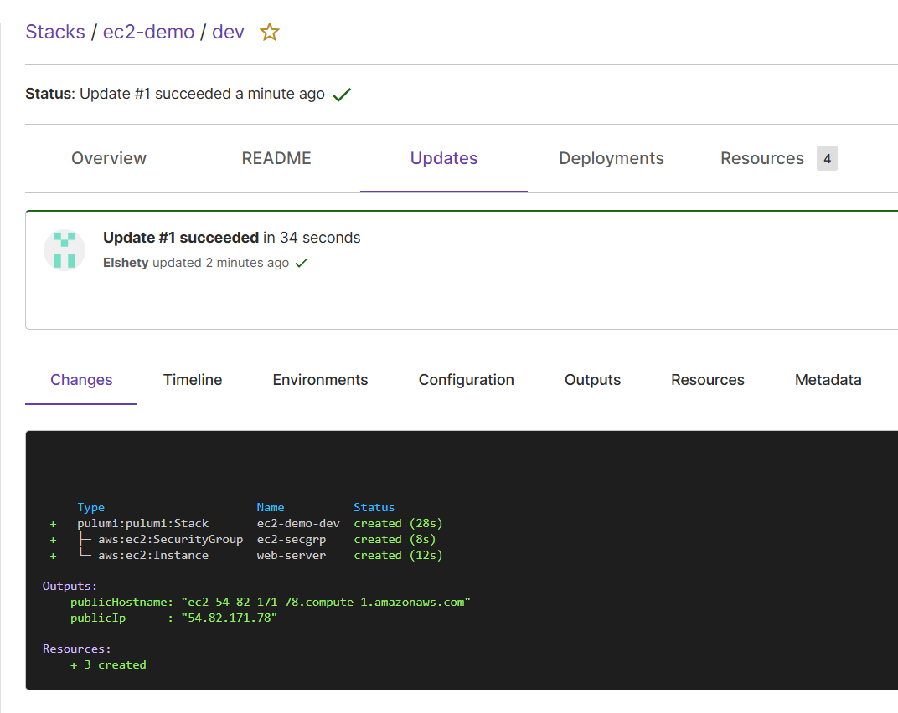


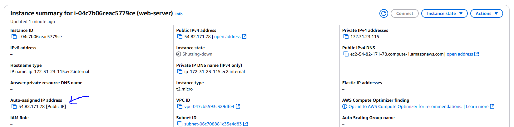

---

## Step 4: Verify Your Deployment
1. Check the deployed instance details:

```bash
pulumi stack output
```

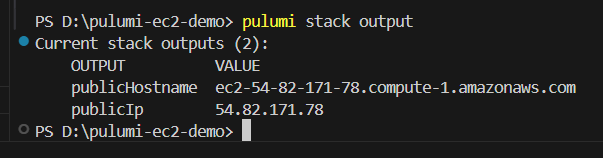


---

## Step 5: Automating Infrastructure Management
**Objective:** Update or clean up resources.

### Instructions:
1. Update infrastructure:
Modify `index.js` and run:

```bash
pulumi up
```

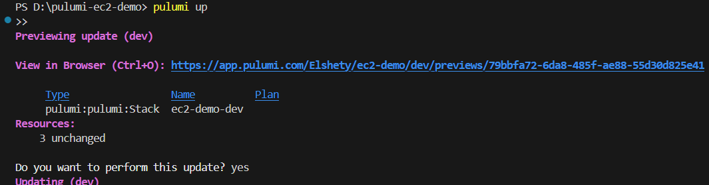


2. Destroy resources (clean up):

```bash
pulumi destroy
```

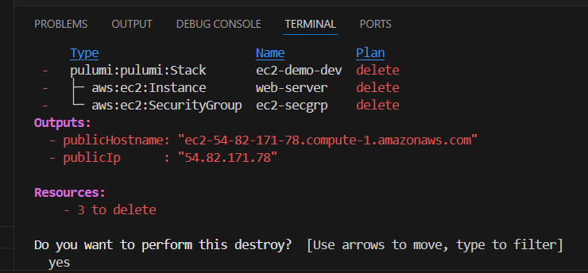


3. Remove the stack (delete state):

```bash
pulumi stack rm
```

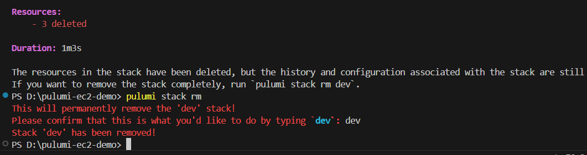

---

## Conclusion
This exercise provides a practical introduction to Infrastructure as Code (IaC) using Pulumi and AWS. Students will understand how to automate cloud deployments, enforce security best practices, and manage infrastructure lifecycle efficiently.
