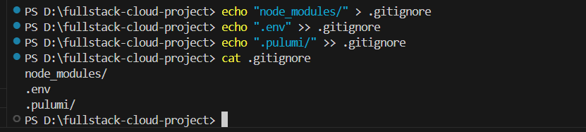
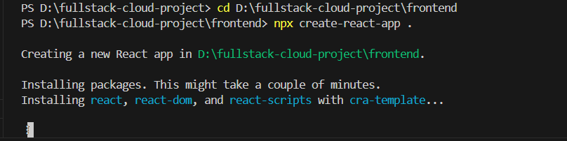
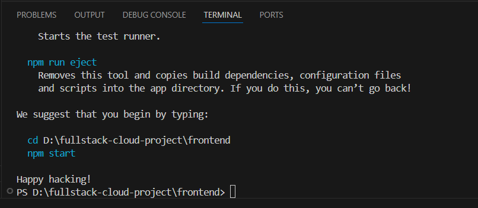

# Final Project: Automating a Full-Stack Cloud Application with CI/CD and IaC

## Introduction
Cloud computing and automation are essential in modern software development. This final project integrates Infrastructure as Code (IaC) and Continuous Integration/Continuous Deployment (CI/CD) to build and automate a full-stack cloud application. By leveraging AWS services, Pulumi, and GitHub Actions, this project will streamline infrastructure provisioning, deployment, and security management. The goal is to create a scalable, reliable, and fully automated cloud-based solution that ensures efficient development and operations.

## Learning Outcomes
By completing this project, you will:
1. Gain hands-on experience in automating cloud infrastructure using Pulumi.
2. Learn how to implement CI/CD pipelines for full-stack applications with GitHub Actions.
3. Understand best practices for deploying and managing frontend, backend, and database services in AWS.
4. Strengthen security knowledge by configuring IAM roles, secrets management, and monitoring tools.
5. Develop the ability to troubleshoot and optimize cloud deployments.


---


# Project Walkthrough


## Step 1: Project Setup

Objective: Establish a scalable project structure and version control foundation.

### 1.1 Create Project Structure
**Purpose:** Organize code into modular directories to isolate frontend, backend, and infrastructure logic.

```bash
mkdir fullstack-cloud-project  
cd fullstack-cloud-project  
mkdir frontend
mkdir backend
mkdir infrastructure  
```

**Structure Overview:**
- `frontend/`: React/Vue/Angular app
- `backend/`: Node.js/Python API (Express.js/FastAPI)
- `infrastructure/`: Pulumi scripts for AWS

### 1.2 Initialize Git Repository
**Purpose:** Enable version tracking and collaboration.

```bash
git init  
echo "node_modules/" > .gitignore  
echo ".env" >> .gitignore  
echo ".pulumi/" >> .gitignore  
```





**Key Files:**
- `.gitignore` excludes dependencies and secrets.

---


## Step 2: Frontend Setup

**Objective:** Build a React frontend with essential tooling.

### 2.1 Initialize React App

```bash
cd frontend  
npx create-react-app .  
```








**Verification:**
- Run `npm start` → Opens [http://localhost:3000](http://localhost:3000).

### 2.2 Install Dependencies
**Purpose:** Add HTTP client (Axios) and routing (React Router).

```bash
npm install axios react-router-dom  
```

**Usage Example:**

```jsx
// App.js
import { BrowserRouter as Router, Routes, Route } from "react-router-dom";
import Home from "./Home";

function App() {
  return (
    <Router>
      <Routes>
        <Route path="/" element={<Home />} />
      </Routes>
    </Router>
  );
}
```

---

## Step 3: Backend Setup

**Objective:** Create a Node.js API with Express.js.

### 3.1 Initialize Node.js App

```bash
cd ../backend  
npm init -y  
```

### 3.2 Install Backend Packages

```bash
npm install express dotenv cors  
```

### 3.3 Configure Server

**File: `server.js`**

```javascript
const express = require("express");
const cors = require("cors");
require("dotenv").config();

const app = express();
app.use(cors());

app.get("/", (req, res) => {
  res.json({ message: "Backend operational!" });
});

const PORT = process.env.PORT || 5000;
app.listen(PORT, () => console.log(`Server running on port ${PORT}`));
```

**Verification:**
- Run `node server.js` → Test via `curl http://localhost:5000`.

---

## Step 4: Infrastructure as Code (Pulumi)

**Objective:** Provision AWS resources programmatically.

### 4.1 Install Pulumi

```bash
cd ../infrastructure  
pip install pulumi pulumi-aws  
pulumi new aws-python  
```

### 4.2 Define AWS Resources

**File: `__main__.py`**

```python
import pulumi_aws as aws

# S3 Bucket for Frontend
frontend_bucket = aws.s3.Bucket("frontend-bucket",
    website=aws.s3.BucketWebsiteArgs(index_document="index.html"))

# RDS MySQL Instance
db_instance = aws.rds.Instance("db-instance",
    engine="mysql", instance_class="db.t2.micro",
    allocated_storage=20, username="admin",
    password=pulumi.Config().require_secret("db_password"))
```

**Key Resources:**
- **S3:** Hosts static frontend.
- **RDS:** Managed MySQL database.
- **EC2:** Backend server (Node.js).

### 4.3 Deploy Infrastructure

```bash
pulumi up  
```

---

## Step 5: CI/CD with GitHub Actions

**Objective:** Automate deployments on code push.

### 5.1 Push to GitHub

```bash
git remote add origin https://github.com/your-username/fullstack-cloud-project.git  
git push -u origin main  
```

### 5.2 Configure GitHub Actions

**File: `.github/workflows/deploy.yml`**

```yaml
jobs:
  deploy-infrastructure:
    steps:
      - uses: pulumi/actions@v3
        env:
          AWS_ACCESS_KEY_ID: ${{ secrets.AWS_ACCESS_KEY_ID }}

  deploy-backend:
    needs: deploy-infrastructure
    steps:
      - run: scp -r backend ec2-user@${{ steps.infra.outputs.backend_ip }}:~/  

  deploy-frontend:
    needs: deploy-infrastructure
    steps:
      - run: aws s3 sync frontend/build s3://${{ steps.infra.outputs.frontend_bucket }}  
```

**Secrets Required:**
- `AWS_ACCESS_KEY_ID`, `PULUMI_ACCESS_TOKEN`, `SSH_PRIVATE_KEY`.

---

## Step 6: Security Hardening

**Objective:** Apply least-privilege principles.

### 6.1 IAM Roles for EC2

```python
backend_role = aws.iam.Role("backend-role",
    assume_role_policy=json.dumps({
        "Version": "2012-10-17",
        "Statement": [{
            "Effect": "Allow",
            "Principal": {"Service": "ec2.amazonaws.com"},
            "Action": "sts:AssumeRole"
        }]
    }))
```

### 6.2 CloudWatch Logging

```python
aws.cloudwatch.LogGroup("backend-logs", retention_in_days=7)
```

---

## Step 7: Deployment & Testing

**Objective:** Validate end-to-end functionality.

### 7.1 Manual Deployment (First Time)

```bash
# Backend
ssh ec2-user@<IP> "cd backend && npm start"

# Frontend
aws s3 sync frontend/build s3://<bucket-name>
```

### 7.2 Verification
1. **Frontend:** Visit S3 website endpoint.
2. **Backend:** Test API at `http://<EC2_IP>:5000`.
3. **Logs:** Check CloudWatch for errors.

---

## Step 8: Final Checks

Confirm:
- CI/CD pipeline triggers on git push.
- All components communicate (frontend → backend → database).
- Security controls (IAM, logging) are active.


## Conclusion

This project consolidates all the key concepts learned throughout the course, demonstrating the ability to design, deploy, and automate a cloud-based application. By successfully implementing an end-to-end CI/CD pipeline with IaC, you will have built a robust, scalable system that mirrors real-world cloud deployment scenarios. This experience will provide a strong foundation for future cloud engineering and DevOps roles.
