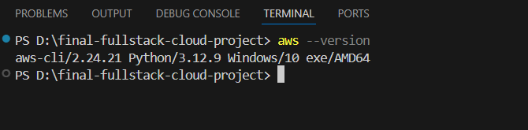

# Final Project: Automating a Full-Stack Cloud Application with CI/CD and IaC

## Project Objective
The objective of this project is to apply the concepts learned in cloud computing by developing and automating a full-stack cloud application. The goal is to create a scalable, automated deployment pipeline that integrates the frontend, backend, and database services across AWS using CI/CD pipelines and Infrastructure as Code (IaC).

---

## Prerequisites

#### 1. Accounts & Services
- **AWS Account** (with permissions for EC2, RDS, S3, IAM, and CloudWatch)
- **GitHub Account** (for repository management and GitHub Actions)
- **Pulumi Account** (for IaC deployment)

#### 2. Software & Tools
- **Git & GitHub CLI** (version control)
- **Pulumi CLI** (AWS infrastructure automation)
- **VS Code (or preferred IDE)** (code editing)
- **AWS CLI** (AWS service management)
- **Node.js (LTS version)** (runtime for Pulumi and backend)

#### 3. Environment Setup
- Install and configure the AWS CLI (`aws configure`).
- Install the Pulumi CLI (`npm install -g pulumi`).
- Set up a GitHub repository and configure GitHub Actions.

---

# Starter Files
You will build the project from scratch, but a pre-configured folder structure is available for reference:


- `/frontend`        # React/Next.js application
- `/backend`         # Node.js/Express API
- `/infrastructure`  # Pulumi IaC definitions

---

# Project Walkthrough

## 1. Installing Required Tools

### Node.js Installation
#### Option A: Official Installer (Recommended for Beginners)
1. Download the LTS version from the [Node.js website](https://nodejs.org/).
2. Run the installer with default settings.

#### Option B: Using nvm 
```bash
curl -o- https://raw.githubusercontent.com/nvm-sh/nvm/v0.39.1/install.sh | bash  
nvm install --lts  
nvm use --lts  
```
**Verification:**
```bash
node --version  # Expected: v18.x or later  
npm --version   # Expected: 9.x or later  
```


### Pulumi Installation
```bash
curl -fsSL https://get.pulumi.com | sh  
```


### AWS CLI Installation
```bash
curl "https://awscli.amazonaws.com/awscli-exe-linux-x86_64.zip" -o "awscliv2.zip"  
unzip awscliv2.zip  
sudo ./aws/install  
aws --version  # Verify installation  
```




### Git Installation
#### Linux (Debian/Ubuntu):
```bash
sudo apt-get update && sudo apt-get install git -y  
```
#### Mac (via Homebrew):
```bash
brew install git  
```
**Verification:**
```bash
git --version  
```


## 2. Configuring AWS Credentials
Run:
```bash
aws configure  
```


Enter the following when prompted:
- **AWS Access Key ID** (from IAM user)
- **AWS Secret Access Key**
- **Default Region** (e.g., `us-east-1`)
- **Default Output Format** (`json`)

> **Security Note:** Never use root account credentials—always create an IAM user with least-privilege permissions.

## 3. Setting Up the GitHub Repository

### Creating the Repository
1. Go to [GitHub.com](https://github.com/).
2. Click `+ New repository`.
3. Name it (e.g., `final-fullstack-cloud-project`).
4. Set to **Private** (recommended).
5. Do not initialize with a README (we’ll do this manually).
6. Click **Create repository**.


### Cloning & Initial Setup
```bash
git clone https://github.com/your-username/final-fullstack-cloud-project.git  
cd final-fullstack-cloud-project
```


## VS Code Integration (Recommended Setup)
1. Open VS Code → `File` → `Open Folder` (select project directory).
2. Install recommended extensions:
   - **ESLint** (JavaScript/TypeScript linting)
   - **Prettier** (code formatting)
   - **Pulumi** (IaC support)

---

## Project Structure

A well-organized project structure is essential for:

- **Separation of Concerns** – Clear division between frontend, backend, and infrastructure.
- **Maintainability** – Easier debugging, updates, and scalability.
- **Collaboration** – Streamlined teamwork with modular components.
- **CI/CD Integration** – Automated workflows depend on a logical directory layout.
- **System Architecture Clarity** – Reflects the application’s design at a glance.

### Final Directory Layout


```plaintext
final-fullstack-cloud-project/  
├── frontend/            # Frontend application (React, Vue, etc.)  
│   ├── public/          # Static assets (HTML, images)  
│   ├── src/             # Application code (components, styles)  
│   └── package.json     # Dependencies and scripts  
├── backend/             # Backend services (Node.js, Python, etc.)  
│   ├── src/             # API routes, business logic  
│   ├── config/          # Database/cloud configurations  
│   └── package.json     # Server dependencies  
├── infrastructure/      # Infrastructure as Code (Pulumi)  
│   ├── index.ts         # AWS resource definitions  
│   └── Pulumi.yaml      # Project configuration  
├── .github/             # GitHub Actions workflows  
│   └── workflows/       # CI/CD pipeline definitions  
└── README.md            # Project overview, setup, and usage  
```


---


## 3.Frontend (React) Setup

### 1. Initializing the React Application

#### Creating the React App

**Command:**

```bash
npx create-react-app frontend --template typescript
cd frontend
```


#### What Happens?
- `npx` downloads and runs `create-react-app` without global installation.
- Creates a `frontend/` directory with:
  - TypeScript preconfigured (`tsconfig.json`).
  - Starter files (`.tsx` instead of `.js`).
  - All required dependencies installed.

#### Key Generated Files:

| File           | Purpose                         |
|---------------|---------------------------------|
| `tsconfig.json` | TypeScript configuration       |
| `src/App.tsx`  | Main React component           |
| `src/index.tsx` | Entry point                    |
| `package.json` | Dependencies and scripts       |

#### Verification:

```bash
npm start
```

- Starts dev server at `http://localhost:3000`.


- Displays default React welcome page.


- Stop server: Press `Ctrl+C` in the terminal.


---

### 2. Building the Frontend Application

#### Modifying `App.tsx`

**Location:** `frontend/src/App.tsx`


```typescript
import React, { useState, useEffect } from 'react';
import './App.css';

function App() {
  // State for storing the message from backend
  const [message, setMessage] = useState('');
  
  // State for storing data from database
  const [data, setData] = useState<any[]>([]);

  // Get API URL from environment variables or use localhost as fallback
  const apiUrl = process.env.REACT_APP_API_URL || 'http://localhost:3001/api';

  // Effect hook to fetch data when component mounts
  useEffect(() => {
    // Fetch simple message from backend
    fetch(`${apiUrl}/message`)
      .then(res => res.json())
      .then(data => setMessage(data.text))
      .catch(err => console.error('Error fetching message:', err));

    // Fetch data from backend (which comes from database)
    fetch(`${apiUrl}/data`)
      .then(res => res.json())
      .then(data => setData(data))
      .catch(err => console.error('Error fetching data:', err));
  }, [apiUrl]); // Dependency array ensures effect runs when apiUrl changes

  return (
    <div className="App">
      <header className="App-header">
        <h1>Cloud Infrastructure Project</h1>
        
        {/* Display message from backend */}
        <p>Message from backend: {message}</p>
        
        <h2>Data from Database:</h2>
        <ul>
          {/* Map through data array and display each item */}
          {data.map((item, index) => (
            <li key={index}>{JSON.stringify(item)}</li>
          ))}
        </ul>
      </header>
    </div>
  );
}

export default App;

**Key Features:**
- **State Management**: `useState` for dynamic data.
- **API Calls**: `fetch` to connect to the backend.
- **TypeScript**: Define interfaces for type safety (replace `any[]` later).
- **Error Handling**: Basic `try/catch` for API errors.
```


---

### 3. Configuring Environment Variables

#### Creating `.env`

**Location:** `frontend/.env`


**Purpose:**
- Store environment-specific settings (e.g., API URLs).
- Keep secrets out of source control.

#### Content:

```env
REACT_APP_API_URL=http://your-ec2-public-ip:3001
```

#### Rules:
- Variables must start with `REACT_APP_` to be accessible in React.
- Add `.env` to `.gitignore` to avoid exposing secrets.

---

### 4. Testing the Frontend Locally

#### Steps:

1. Start the dev server:

    ```bash
    cd frontend
    npm start
    ```

2. Verify:
   - App opens at `http://localhost:3000`.
   - No errors in the browser console.


  
---

## 4. Backend (Node.js) Setup

### 1. Initializing the Backend Project

#### Creating the Node.js Project

Commands:


##### Navigate to backend directory

```bash
cd ../backend
```


##### Initialize Node.js project (creates package.json)

```bash
npm init -y
```


##### Install production dependencies

```bash
npm install express cors pg dotenv
```


##### Install development dependencies (TypeScript support)

```bash
npm install --save-dev typescript @types/express @types/cors @types/node @types/pg nodemon
```


#### Key Dependencies:

| Package    | Purpose                               |
|-----------|---------------------------------------|
| express   | Web framework                         |
| cors      | Cross-Origin Resource Sharing        |
| pg        | PostgreSQL client                    |
| dotenv    | Environment variables                |
| typescript| TypeScript compiler                  |
| nodemon   | Auto-restart server during development |

---

### 2. Configuring TypeScript

#### Initialize TypeScript:

```bash
npx tsc --init
```


This generates `tsconfig.json` with default settings.

#### Recommended `tsconfig.json` Adjustments:

```json
{
  "compilerOptions": {
    "target": "ES2020",
    "module": "commonjs",
    "outDir": "./dist",
    "rootDir": "./src",
    "strict": true,
    "esModuleInterop": true,
    "skipLibCheck": true,
    "forceConsistentCasingInFileNames": true,
    "moduleResolution": "node"
  },
  "include": ["src/**/*"],
  "exclude": ["node_modules"]
}
```


---

### 3. Creating the Backend Application

#### Main Application File (`src/index.ts`)

Location: `backend/src/index.ts`

```typescript
import express from 'express';
import cors from 'cors';
import { Pool } from 'pg';

// Initialize Express application
const app = express();

// Middleware setup
app.use(cors()); // Enable CORS for all routes
app.use(express.json()); // Parse JSON request bodies

// Database connection configuration
const pool = new Pool({
  user: process.env.DB_USER,       // Database username
  host: process.env.DB_HOST,       // Database host (RDS endpoint)
  database: process.env.DB_NAME,    // Database name
  password: process.env.DB_PASSWORD,// Database password
  port: parseInt(process.env.DB_PORT || '5432'), // Database port
});

// Simple test endpoint
app.get('/api/message', (req, res) => {
  // Returns a simple JSON response
  res.json({ text: 'Hello from the backend!' });
});

// Database interaction endpoint
app.get('/api/data', async (req, res) => {
  try {
    // Query the database
    const result = await pool.query('SELECT * FROM sample_data');
    
    // Return query results
    res.json(result.rows);
  } catch (err) {
    // Error handling
    console.error(err);
    res.status(500).json({ error: 'Database query failed' });
  }
});

// Health check endpoint
app.get('/api/health', (req, res) => {
  res.json({ status: 'OK' });
});

// Server configuration
const PORT = process.env.PORT || 3001;
app.listen(PORT, () => {
  console.log(`Backend server running on port ${PORT}`);
});
```


---

### 4. Database Initialization

#### SQL Script (`src/db-init.sql`)

Location: `backend/src/db-init.sql`


---

### 5. Environment Configuration

#### Create `.env` File

```bash
touch .env
```

#### Sample `.env` Content:

```env
DB_USER=admin
DB_HOST=localhost
DB_NAME=mydatabase
DB_PASSWORD=securepassword
DB_PORT=5432
PORT=3001
```

#### Security Note:

- Add `.env` to `.gitignore`
- Never commit sensitive data to version control

---

### 6. Development Setup

#### `package.json` Scripts

```json
"scripts": {
  "build": "tsc",
  "start": "node dist/index.js",
  "dev": "nodemon src/index.ts",
  "watch": "tsc -w"
}
```

#### Nodemon Configuration (`nodemon.json`)

```json
{
  "watch": ["src"],
  "ext": "ts,json",
  "ignore": ["src/**/*.spec.ts"],
  "exec": "ts-node src/index.ts"
}
```

---

### 7. Running the Backend

#### Development Mode

```bash
npm run dev
```

- Auto-restarts server on file changes
- Uses `ts-node` for direct TypeScript execution

#### Testing Endpoints

1. **Health Check:**
   
   `http://localhost:3001/api/health`

   Expected Response:
   
   ```json
   {"status":"OK"}
   ```


   
1. **Test Message:**
   
   `http://localhost:3001/api/message`
   
   Expected Response:
   
   ```json
   {"message":"Hello from backend!"}
   


---

## 5. Pulumi Infrastructure as Code

### Initialize Pulumi Project

```
cd ../infrastructure
pulumi new aws-javascript
# Follow prompts to name your project (e.g., fullstack-cloud) and stack (e.g., dev)
```

### Install Required Pulumi Packages

```
npm install @pulumi/aws @pulumi/awsx @pulumi/pulumi
Create Infrastructure Code
```

### Create Infrastructure Code:
Create a new file infrastructure/index.js and add the following code:

### 3.1. VPC Setup

```javascript
const aws = require("@pulumi/aws");
const awsx = require("@pulumi/awsx");
const pulumi = require("@pulumi/pulumi");

// Create a VPC
const vpc = new awsx.ec2.Vpc("fullstack-vpc", {
    cidrBlock: "10.0.0.0/16",
    numberOfAvailabilityZones: 2,
    subnets: [{ type: "public" }, { type: "private" }],
});
```


3.2. S3 Bucket for Frontend

```javascript
// Create an S3 bucket for the frontend
const frontendBucket = new aws.s3.Bucket("frontend-bucket", {
    website: {
        indexDocument: "index.html",
        errorDocument: "index.html",
    },
    acl: "public-read",
});

// Create a bucket policy to allow public read access
const bucketPolicy = new aws.s3.BucketPolicy("bucketPolicy", {
    bucket: frontendBucket.bucket,
    policy: frontendBucket.bucket.apply(bucketName => JSON.stringify({
        Version: "2012-10-17",
        Statement: [{
            Effect: "Allow",
            Principal: "*",
            Action: ["s3:GetObject"],
            Resource: [`arn:aws:s3:::${bucketName}/*`],
        }],
    })),
});
```

```
// Create an RDS PostgreSQL instance
const dbSubnetGroup = new aws.rds.SubnetGroup("db-subnet-group", {
    subnetIds: vpc.privateSubnetIds,
});

const dbSecurityGroup = new aws.ec2.SecurityGroup("db-security-group", {
    vpcId: vpc.vpcId,
    ingress: [{
        protocol: "tcp",
        fromPort: 5432,
        toPort: 5432,
        cidrBlocks: ["0.0.0.0/0"],
    }],
    egress: [{
        protocol: "-1",
        fromPort: 0,
        toPort: 0,
        cidrBlocks: ["0.0.0.0/0"],
    }],
});

const rdsInstance = new aws.rds.Instance("backend-db", {
    engine: "postgres",
    instanceClass: "db.t3.micro",
    allocatedStorage: 20,
    dbSubnetGroupName: dbSubnetGroup.name,
    vpcSecurityGroupIds: [dbSecurityGroup.id],
    username: "admin",
    password: "securepassword123", // In production, use a secret manager
    skipFinalSnapshot: true,
    publiclyAccessible: true,
});

// Create an EC2 instance for the backend
const ec2SecurityGroup = new aws.ec2.SecurityGroup("backend-security-group", {
    vpcId: vpc.vpcId,
    ingress: [
        {
            protocol: "tcp",
            fromPort: 22,
            toPort: 22,
            cidrBlocks: ["0.0.0.0/0"],
        },
        {
            protocol: "tcp",
            fromPort: 3001,
            toPort: 3001,
            cidrBlocks: ["0.0.0.0/0"],
        },
    ],
    egress: [{
        protocol: "-1",
        fromPort: 0,
        toPort: 0,
        cidrBlocks: ["0.0.0.0/0"],
    }],
});

const ami = aws.ec2.getAmi({
    filters: [
        { name: "name", values: ["amzn2-ami-hvm-*-x86_64-gp2"] },
    ],
    owners: ["137112412989"], // Amazon
    mostRecent: true,
}).then(ami => ami.id);

const userData = `#!/bin/bash
sudo yum update -y
sudo amazon-linux-extras install docker -y
sudo service docker start
sudo usermod -a -G docker ec2-user
sudo curl -L "https://github.com/docker/compose/releases/download/1.29.2/docker-compose-$(uname -s)-$(uname -m)" -o /usr/local/bin/docker-compose
sudo chmod +x /usr/local/bin/docker-compose
`;

const ec2Instance = new aws.ec2.Instance("backend-instance", {
    instanceType: "t3.micro",
    vpcSecurityGroupIds: [ec2SecurityGroup.id],
    subnetId: vpc.publicSubnetIds[0],
    ami: ami,
    keyName: "your-key-pair-name", // Replace with your EC2 key pair name
    userData: userData,
    tags: {
        Name: "BackendServer",
    },
});

// Export the outputs
exports.frontendUrl = pulumi.interpolate`http://${frontendBucket.websiteEndpoint}`;
exports.backendUrl = pulumi.interpolate`http://${ec2Instance.publicIp}:3001`;
exports.dbEndpoint = rdsInstance.endpoint;
```

---

# Code Explanation

### VPC Setup:
- **cidrBlock**: Configures the IP range for the VPC.
- **numberOfAvailabilityZones**: Ensures redundancy by deploying across two availability zones.
- **subnets**: Creates both public and private subnets for separating resources.

### S3 Bucket for Frontend:
- Configures a static website for the frontend with `index.html` as the entry point and `index.html` for error handling.
- **acl**: Grants public read access to all objects in the bucket.
- **Bucket Policy**: Ensures that the public can read the contents of the S3 bucket.

### RDS PostgreSQL Instance:
- **Subnet Group**: Places the RDS instance in private subnets for security.
- **Security Group**: Allows TCP access on port 5432 (PostgreSQL).
- **RDS Instance**: Configures a PostgreSQL database with a `t3.micro` instance for low-cost, small workloads.

### EC2 Instance for Backend:
- **Security Group**: Allows SSH (port 22) and the backend API port (port 3001).
- **AMI Lookup**: Retrieves the most recent Amazon Linux 2 AMI for the EC2 instance.
- **User Data Script**: Installs Docker and Docker Compose on the EC2 instance.
- **EC2 Instance Creation**: Deploys the backend server on EC2.

### Outputs:
- **Frontend URL**: Exports the URL for the frontend hosted on the S3 bucket.
- **Backend URL**: Exports the URL for the backend API running on the EC2 instance.
- **Database Endpoint**: Exports the endpoint of the RDS database.

---

# 6. CI/CD Pipeline with GitHub Actions

## Understanding GitHub Actions Workflows

### Purpose of CI/CD Pipelines:
- Automate deployment processes
- Ensure consistent builds
- Reduce human error
- Enable rapid iteration
- Provide rollback capabilities

### Key Components:
- **Workflows**: Defined in YAML files in `.github/workflows/`
- **Events**: Triggers for workflows (e.g., push to main branch)
- **Jobs**: Sets of steps that run on the same runner
- **Steps**: Individual tasks that run commands or actions

## 1. Frontend Deployment Workflow

**File Location**: `.github/workflows/frontend-deploy.yml`

```
name: Deploy Frontend to S3

on:
  push:
    branches: [ main ]
    paths: [ 'frontend/**' ]

jobs:
  deploy:
    runs-on: ubuntu-latest

    steps:
    - name: Checkout code
      uses: actions/checkout@v2

    - name: Configure AWS credentials
      uses: aws-actions/configure-aws-credentials@v1
      with:
        aws-access-key-id: ${{ secrets.AWS_ACCESS_KEY_ID }}
        aws-secret-access-key: ${{ secrets.AWS_SECRET_ACCESS_KEY }}
        aws-region: us-east-1

    - name: Install dependencies
      run: |
        cd frontend
        npm install

    - name: Build frontend
      run: |
        cd frontend
        npm run build

    - name: Deploy to S3
      run: |
        aws s3 sync frontend/build/ s3://$(aws s3api list-buckets --query "Buckets[?contains(Name, 'frontend-bucket')].Name" --output text) --delete
```

# Workflow Breakdown:

## Trigger Explanation:
- Runs when code is pushed to the main branch
- Only triggers when files in `frontend/` directory change
- Prevents unnecessary runs when only backend changes occur

## Jobs Configuration:
- Uses GitHub-hosted Ubuntu runner
- Single job named "deploy"

## Steps Details:
1. **Checkout Code**:
   - Checks out your repository content
   - Required for all workflows that need your code

2. **Configure AWS Credentials**:
   - Sets up AWS CLI with credentials
   - Uses GitHub secrets for secure credential storage
   - Configures region matching your infrastructure

3. **Install Dependencies**:
   - Navigates to `frontend` directory
   - Installs all npm packages
   - Creates `node_modules` with production dependencies

4. **Build Frontend**:
   - Creates optimized production build
   - Outputs to `frontend/build/` directory
   - Includes minified JS, CSS, and assets

5. **Deploy to S3**:
   - Uses AWS CLI to sync build directory with S3 bucket
   - Dynamically finds bucket name (created by Pulumi)
   - `--delete` removes files in S3 not present in build


---


## 2. Backend Deployment Workflow
**File Location**: `.github/workflows/backend-deploy.yml`


```
name: Deploy Backend to EC2

on:
  push:
    branches: [ main ]
    paths: [ 'backend/**' ]

jobs:
  deploy:
    runs-on: ubuntu-latest

    steps:
    - name: Checkout code
      uses: actions/checkout@v2

    - name: Configure AWS credentials
      uses: aws-actions/configure-aws-credentials@v1
      with:
        aws-access-key-id: ${{ secrets.AWS_ACCESS_KEY_ID }}
        aws-secret-access-key: ${{ secrets.AWS_SECRET_ACCESS_KEY }}
        aws-region: us-east-1

    - name: Install dependencies
      run: |
        cd backend
        npm install

    - name: Package backend
      run: |
        cd backend
        tar -czf backend.tar.gz *

    - name: Deploy to EC2
      uses: appleboy/scp-action@master
      with:
        host: ${{ secrets.EC2_HOST }}
        username: ec2-user
        key: ${{ secrets.EC2_SSH_KEY }}
        source: "backend/backend.tar.gz"
        target: "/home/ec2-user"

    - name: SSH and restart backend
      uses: appleboy/ssh-action@master
      with:
        host: ${{ secrets.EC2_HOST }}
        username: ec2-user
        key: ${{ secrets.EC2_SSH_KEY }}
        script: |
          cd /home/ec2-user
          tar -xzf backend.tar.gz
          npm install
          pm2 stop backend || true
          pm2 start src/index.js --name "backend"
```

## 3. Setting Up Required Secrets
Before workflows can run, you need to configure GitHub secrets:
#### 1.	AWS Credentials:
- AWS_ACCESS_KEY_ID: From your IAM user
- AWS_SECRET_ACCESS_KEY: Corresponding secret key
#### 2.	EC2 Connection Details:
- EC2_HOST: Public IP or DNS of your EC2 instance
- EC2_SSH_KEY: Private key content for SSH access

How to Add Secrets in GitHub:
1.	Go to your repository on GitHub
2.	Settings > Secrets > Actions
3.	Click "New repository secret"
4.	Enter name and value for each secret

Important Security Notes:
- Never commit secrets to your repository
- Use least-privilege IAM policies
- Rotate credentials regularly
- Consider using AWS IAM Roles instead of keys for production


---

# 7. Security and Monitoring Implementation

## 1. IAM Roles and Policies

### Purpose of IAM Configuration
- **Principle of Least Privilege**: Grant only necessary permissions
- **Secure Access Control**: Manage who can access which AWS resources
- **Automated Credential Management**: Avoid hard-coded credentials

### Implementation in Pulumi
1. **Creating the IAM Role**

2. **Attaching Policies**
   - **Policy Details**:
     - **AmazonS3ReadOnlyAccess**:
       - Allows reading from any S3 bucket
       - Needed if your backend accesses S3 resources
       - Consider restricting to specific buckets in production
     - **CloudWatchAgentServerPolicy**:
       - Enables sending logs and metrics to CloudWatch
       - Required for proper monitoring

3. **Creating Instance Profile**

4. **Assigning to EC2 Instance**

---

## 2. CloudWatch Logging and Alarms


---


# 8. Final Deployment and Testing

## 1. Committing and Pushing Code
### Purpose:
- Stages all changes (`git add .`)
- Creates a commit with a descriptive message
- Pushes code to GitHub, triggering CI/CD pipelines

### What Happens Next:
3. GitHub Actions will:
   - Deploy the frontend to S3 (from the frontend workflow)
   - Deploy the backend to EC2 (from the backend workflow)

4. Each workflow runs independently but in parallel

---

## 2. Deploying Infrastructure
### Workflow:
4. Pulumi shows a preview of resources to be created/modified.
5. You must type "yes" to confirm deployment.
6. Pulumi provisions resources in the correct dependency order:
   - First creates VPC and networking components
   - Then creates the S3 bucket and RDS instance
   - Finally, creates the EC2 instance with proper security groups

### Monitoring Deployment:
- Watch for any errors in the Pulumi output.
- Note that RDS creation can take 10-15 minutes.
- The EC2 instance will be available sooner but needs time to initialize.

---

## 3. Capturing Outputs
### Expected Outputs:
- `frontendUrl`: S3 website endpoint (e.g., `http://frontend-bucket-123.s3-website-us-east-1.amazonaws.com`)
- `backendUrl`: EC2 public IP with port (e.g., `http://54.210.32.1:3001`)
- `dbEndpoint`: RDS connection endpoint (e.g., `backend-db-123.abcdefgh.us-east-1.rds.amazonaws.com:5432`)

### Important:
Save these outputs for testing and configuration!

---

## 4. Backend API Testing
### Health Check Endpoint:
**Expected Response:**

### Message Endpoint:
**Expected Response:**

---

## 5. Comprehensive Testing Strategy

### Frontend Testing:
3. Access the frontend URL:
   - Open the browser to `frontendUrl` from Pulumi outputs.
   - The page should display the "Cloud Infrastructure Project" heading.

4. Verify components:
   - Check for the message "Hello from the backend!".
   - This confirms successful frontend-backend communication.

---

# Conclusion
Automating cloud deployments enhances efficiency, security, and scalability. This project demonstrates best practices in CI/CD, cloud automation, and monitoring using AWS. By following this guide, you will successfully deploy a React frontend, Node.js backend, and RDS database, all managed through an automated pipeline. These skills are essential for real-world cloud engineering.
