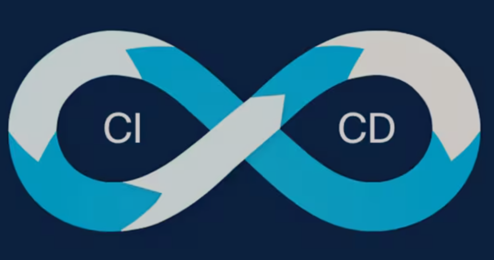

# Lesson: Continuous Integration & Deployment (CI/CD) Fundamentals

## Introduction
CI/CD (Continuous Integration and Continuous Deployment) is a cornerstone of modern software development. It enables teams to deliver high-quality software faster and more reliably by automating the integration, testing, and deployment processes. This lesson explores the fundamentals of CI/CD, its benefits, implementation across major cloud platforms, essential tools, and best practices for building and maintaining CI/CD pipelines.

---

## Learning Outcomes
By the end of this lesson, you will:
1. **Understand CI/CD Concepts**: Learn what Continuous Integration (CI) and Continuous Deployment (CD) are and why they are critical for modern software development.
2. **Explore Cloud-Specific Implementations**: Compare how AWS, Azure, and Google Cloud support CI/CD workflows.
3. **Identify Key CI/CD Tools**: Gain familiarity with tools like GitHub Actions, Jenkins, and AWS CodeDeploy.
4. **Build a CI/CD Pipeline**: Learn the steps to set up and automate a CI/CD pipeline, including build, test, and deploy stages.
5. **Apply Best Practices**: Discover strategies to overcome challenges and adopt future trends like GitOps and AI/ML in CI/CD.

---

## Understanding CI/CD: The Foundation of Modern Software Development




CI/CD stands for Continuous Integration (CI) and Continuous Deployment (CD). These practices are at the heart of modern software development, enabling teams to deliver high-quality software faster and more reliably.

- **Continuous Integration (CI)**:
  Developers frequently integrate their code changes into a shared repository, often multiple times a day. Each integration triggers an automated build and testing process, ensuring the codebase is always in a releasable state. This helps catch integration issues early and maintains code quality.

- **Continuous Deployment (CD)**:
  CD takes CI a step further by automatically deploying code changes to production or staging environments after successful builds and tests. This ensures the software is always deployable and can be released to users at any time.


### Why CI/CD Matters: Benefits for Development Teams
CI/CD is not just a technical practice—it’s a game-changer for development teams. Here’s why:
1. **Faster Time-to-Market**: Automation reduces manual effort, speeding up the release cycle.
2. **Improved Code Quality**: Automated testing catches bugs early, ensuring only high-quality code is deployed.
3. **Reduced Risk**: Frequent, small updates are easier to troubleshoot and roll back compared to large, infrequent releases.
4. **Enhanced Collaboration**: Frequent integration encourages teamwork and reduces conflicts.
5. **Scalability**: CI/CD pipelines can handle large-scale applications and multiple environments, making it easier to scale development efforts.


### How CI/CD Reduces Manual Work, Minimizes Errors, and Speeds Up Delivery
- **Automation**: Replaces repetitive manual tasks with automated workflows.
- **Consistency**: Ensures the same process is followed every time, reducing human error.
- **Efficiency**: Shortens the time between code changes and deployment, enabling rapid iteration.

---

## CI/CD in Different Cloud Environments: AWS, Azure, and Google Cloud
CI/CD is a universal concept, but its implementation varies across cloud platforms. Let’s explore how AWS, Azure, and Google Cloud support CI/CD and what makes each unique.

- **AWS**:
  Offers services like AWS CodePipeline, CodeBuild, and CodeDeploy, which are tightly integrated with AWS infrastructure (e.g., EC2, S3). Ideal for applications already using AWS services.

- **Azure**:
  Provides Azure DevOps and Azure Pipelines, which integrate seamlessly with Microsoft tools like Visual Studio. Best suited for Microsoft-centric environments.

- **Google Cloud**:
  Focuses on containerized workloads with tools like Google Cloud Build and Cloud Deploy, making it a great choice for Kubernetes-based applications.


### Choosing the Right Cloud-Based CI/CD Solution
The choice of platform depends on your application’s needs:
- **AWS**: Best for applications deeply integrated with AWS services.
- **Azure**: Ideal for teams using Microsoft tools and services.
- **Google Cloud**: Perfect for containerized and Kubernetes-based workloads.


### Example Workflows in Each Cloud Environment
- **AWS**:
  Code changes → AWS CodePipeline → AWS CodeBuild → AWS CodeDeploy → EC2 instance.

- **Azure**:
  Code commit → Azure Pipelines → Build and test → Deploy to Azure App Service or Kubernetes.

- **Google Cloud**:
  Code push → Cloud Build → Test → Deploy to Google Kubernetes Engine (GKE) or App Engine.


| Feature               | AWS                                                                 | Azure                                                                 | Google Cloud                                                                 |
|-----------------------|---------------------------------------------------------------------|-----------------------------------------------------------------------|------------------------------------------------------------------------------|
| **Primary CI/CD Tools** | - AWS CodePipeline (orchestration) <br> - AWS CodeBuild (build) <br> - AWS CodeDeploy (deployment) | - Azure DevOps (end-to-end) <br> - Azure Pipelines (CI/CD workflows) | - Cloud Build (serverless CI) <br> - Cloud Deploy (managed deployments)      |
| **Key Strengths**     | - Deep AWS integration (EC2, Lambda, S3) <br> - Supports blue/green deployments | - Native Microsoft ecosystem (VS, .NET) <br> - Multi-cloud support | - Optimized for containers/Kubernetes (GKE) <br> - Serverless-first approach |
| **Best For**          | - Teams heavily invested in AWS <br> - Hybrid cloud deployments               | - Enterprises using Microsoft stack <br> - Windows-based workloads  | - Kubernetes-native apps <br> - AI/ML workloads (TensorFlow, Vertex AI)     |
| **Unique Feature**    | **CodeStar** (Quickstart CI/CD templates)                            | **Azure Artifacts** (Integrated package management)                  | **Tekton** (Kubernetes-native pipeline engine)                               |
| **Pricing Model**     | Pay-per-use (CodeBuild minutes, CodePipeline actions)                | Free tier available (Azure Pipelines: 1,800 min/month)               | Free tier (120 build-min/day) + pay-per-use                                 |


---

## Common CI/CD Tools: Powering Automation
### The Tools That Make CI/CD Possible
CI/CD relies on powerful tools to automate workflows. Here are some of the most widely used ones:
- **GitHub Actions**:
  Integrated directly into GitHub repositories, GitHub Actions automates builds, tests, and deployments using YAML configuration files. It’s easy to set up and supports a wide range of programming languages.

- **Jenkins**:
  An open-source automation server, Jenkins is highly customizable with a vast plugin ecosystem. It can be self-hosted and supports distributed builds across multiple machines.

- **AWS CodeDeploy**:
  A deployment service that automates application deployments to EC2 instances, Lambda functions, and ECS services. It supports blue/green deployments for minimal downtime.


### How These Tools Work in Practice
- **GitHub Actions**:
  A developer pushes code to GitHub → GitHub Actions runs tests → Deploys to AWS or Azure.

- **Jenkins**:
  Code is committed to a Git repository → Jenkins pulls the code → Builds, tests, and deploys to a staging environment.

- **AWS CodeDeploy**:
  A CI pipeline builds and tests an application → AWS CodeDeploy deploys it to EC2 or Lambda.

---

## Building and Automating a CI/CD Pipeline
1. **Choose a CI/CD Tool**: Select a tool like GitHub Actions, Jenkins, or AWS CodeDeploy based on your needs.
2. **Define Pipeline Stages**: Break the pipeline into stages—build, test, and deploy.
3. **Write Configuration Files**: Use YAML or other formats to define the workflow.


### Essential Stages in a CI/CD Pipeline
- **Build**: Compile or package the code.
- **Test**: Run automated tests (unit, integration, end-to-end).
- **Deploy**: Deploy the application to staging or production.


---

## Integrating Automated Testing in CI/CD Pipelines

Automated testing is a **core component** of any robust CI/CD pipeline. It ensures that every code change is **thoroughly validated** before reaching production, reducing bugs, improving reliability, and accelerating delivery.

### Why Automated Testing is Essential in CI/CD

1. **Early Bug Detection**
   - Catches issues **immediately** when code is committed, preventing bugs from reaching production.
   - Example: A unit test fails → Pipeline blocks deployment → Developer fixes the issue before release.

2. **Consistent Quality Assurance**
   - Eliminates human error in manual testing.
   - Ensures **every build** undergoes the same rigorous checks.

3. **Faster Feedback Loops**
   - Developers get **instant test results** instead of waiting for QA cycles.
   - Speeds up development by reducing debugging time.

4. **Supports Continuous Deployment (CD)**
   - Without automated tests, **manual verification** would slow down deployments.
   - Enables **true CD** where code is automatically released if all tests pass.


### Types of Automated Tests in CI/CD

| Test Type          | Purpose | Tools Example | When to Run in Pipeline? |
|--------------------|---------|--------------|--------------------------|
| **Unit Tests**     | Tests individual functions/methods | JUnit (Java), pytest (Python), NUnit (.NET) | **First stage** (immediately after build) |
| **Integration Tests** | Checks interactions between modules/services | TestNG, Postman, REST Assured | **After unit tests pass** |
| **End-to-End (E2E) Tests** | Validates full user workflows | Selenium, Cypress, Playwright | **Pre-deployment** (before release) |
| **Security Tests** | Scans for vulnerabilities | OWASP ZAP, SonarQube, Snyk | **Post-build, pre-deploy** |
| **Performance Tests** | Ensures system handles load | JMeter, Gatling, k6 | **Before major releases** |


### How to Integrate Automated Testing into CI/CD

#### Step 1: Choose the Right Testing Tools
- **Unit/Integration Tests:** JUnit (Java), pytest (Python), xUnit (.NET)
- **E2E Tests:** Selenium (web), Cypress (modern web), Appium (mobile)
- **Security Tests:** SonarQube (static analysis), OWASP ZAP (dynamic scanning)

#### Step 2: Configure Tests in the Pipeline
Example (GitHub Actions YAML):

```yaml
jobs:
  test:
    runs-on: ubuntu-latest
    steps:
      - name: Run Unit Tests  
        run: pytest tests/unit/  # Python example
      
      - name: Run E2E Tests  
        run: npx cypress run     # Cypress example
```

### Step 3: Define Failure Handling

- **Fail Fast**: If unit tests fail → Pipeline stops immediately.
- **Parallel Testing**: Run different test suites simultaneously to save time.
- **Test Reports**: Generate logs (e.g., JUnit XML) for debugging.

### Best Practices for Automated Testing in CI/CD

- **Prioritize Speed** – Unit tests should run in seconds; save slower E2E tests for later stages.  
- Keep Tests Isolated** – Avoid dependencies on external systems (use mocks/stubs).  
- **Maintain Test Data** – Use consistent datasets to prevent flaky tests.  
- **Monitor Test Coverage** – Aim for >80% unit test coverage (tools: JaCoCo, Coverage.py).  
- **Shift Left Security** – Run SAST/DAST scans early in the pipeline.  

### Example CI/CD Pipeline with Automated Testing

1. **Commit Code** → Triggers pipeline.
2. **Build Stage** → Compiles code.
3. **Unit Tests** → Fast validation of logic.
4. **Integration Tests** → Checks service interactions.
5. **E2E Tests** → Validates user flows.
6. **Security Scan** → Detects vulnerabilities.
7. **Deploy to Staging** → If all tests pass.
8. **Manual Approval (Optional)** → For production.


---

## Best Practices, and Challenges in CI/CD
### Best Practices for CI/CD
1. **Automate Everything**: From builds to infrastructure provisioning.
2. **Use Version Control**: Store code, configurations, and infrastructure definitions in a VCS.
3. **Monitor and Log**: Track pipeline health and application performance.
4. **Prioritize Security**: Integrate security checks (e.g., static code analysis) into the pipeline.
5. **Create Feedback Loops**: Provide developers with quick feedback on their changes.


### Challenges in CI/CD
1. **Complexity**: Setting up and maintaining pipelines can be challenging, especially for large systems.
2. **Cultural Shift**: Adopting CI/CD requires changes in team workflows and mindsets.
3. **Tool Integration**: Combining multiple tools and platforms may require custom scripting.


---

## Conclusion
CI/CD is a transformative approach that enhances software delivery by automating repetitive tasks, improving code quality, and fostering team collaboration. By understanding its principles, tools, and best practices, development teams can reduce risks, accelerate time-to-market, and scale their efforts effectively. As technology evolves, trends like GitOps and AI-driven pipelines will further shape the future of CI/CD, making it an indispensable practice for modern software development.
