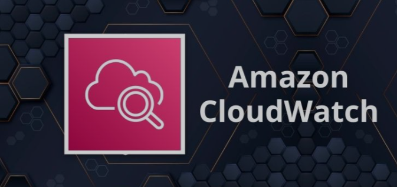
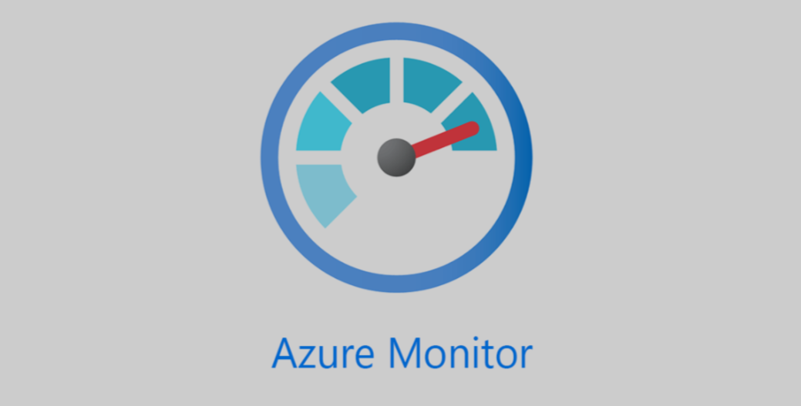
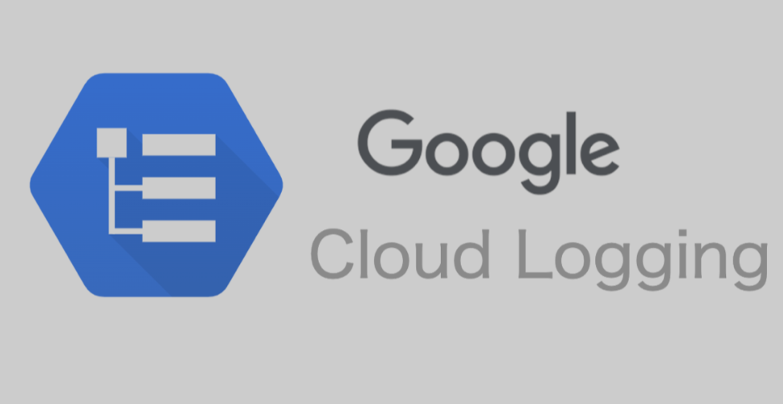
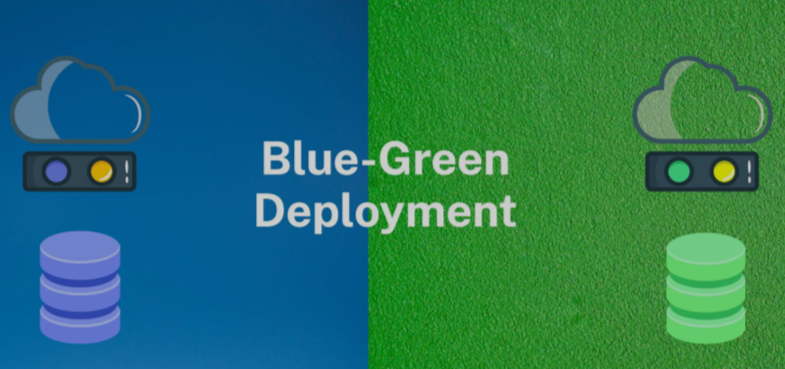

# Lesson: Monitoring & Securing CI/CD Pipelines in Cloud Environments

## Introduction

Effective CI/CD pipelines require robust monitoring, rollback strategies, and security measures to ensure reliable and secure deployments. This lesson covers how to track pipeline health, implement fail-safes for failed deployments, and enforce security best practices across AWS, Azure, and Google Cloud platforms.

---

## Learning Outcomes

By the end of this lesson, you will:

1. Monitor CI/CD pipelines using platform-specific tools (AWS CloudWatch, Azure Monitor, Google Cloud Logging) to track metrics like success rates and deployment duration.
2. Implement rollback strategies (blue/green, canary, automated) to quickly revert failed deployments and minimize downtime.
3. Secure CI/CD pipelines with IAM roles, service principals, and secrets management to prevent unauthorized access and leaks.
4. Enforce policies to maintain compliance and security across AWS, Azure, and Google Cloud deployments.
5. Automate health checks and alerts to proactively detect and resolve deployment issues.

---

## Why Monitoring CI/CD Deployments Matters

Keeping an eye on your CI/CD pipelines is like having a dashboard for your software delivery process—it tells you what’s working, what’s failing, and where things might be slowing down. If something breaks, you’ll know right away instead of finding out from users. The goal? Fewer surprises, faster fixes, and more reliable releases.

### What Should You Watch For?

- **Build success/failure rates** – Are most builds passing, or is there a recurring issue?
- **Deployment duration** – Are deployments taking longer than usual? That could hint at bottlenecks.
- **Resource usage (CPU, memory, etc.)** – If builds are hogging resources, your pipeline might need tuning.
- **Error logs** – The details behind why a build or deployment failed.

### How to Monitor with AWS CloudWatch

#### What It Does:

CloudWatch is AWS’s built-in monitoring tool. It tracks logs, metrics, and can even alert you if something goes wrong in your CI/CD process.




#### How to Set It Up:

1. Turn on logging for CodePipeline, CodeBuild, and CodeDeploy—otherwise, you’re flying blind.
2. Create dashboards to visualize key metrics (like deployment times or failure rates).
3. Set up alarms (e.g., get a Slack or email alert if a deployment fails).

#### Real-World Example:

- Use CloudWatch Logs to see detailed CodeBuild output.
- Create an SNS alert that pings your team if a production deployment fails.

### How to Monitor with Azure Monitor

#### What It Does:

Azure Monitor gives you full visibility into Azure Pipelines, App Services, and more. It collects logs, performance data, and even application-specific insights.





#### How to Set It Up:

1. Enable diagnostics for Azure Pipelines and App Services—this feeds data into Azure Monitor.
2. Use Log Analytics to dig into logs (e.g., search for "failed deployment" trends).
3. Configure alerts for things like slow deployments or crashing apps.

#### Real-World Example:

- Use Application Insights to track API response times.
- Get an alert if your app’s error rate suddenly spikes.

### How to Monitor with Google Cloud Logging

#### What It Does:

Google Cloud Logging (formerly Stackdriver) keeps tabs on Cloud Build, Cloud Run, and other GCP services. It’s great for tracking deployments and spotting issues.





#### How to Set It Up:

1. Enable logging for Cloud Build and Cloud Run—otherwise, you won’t see any logs.
2. Build dashboards in Cloud Monitoring to track deployment health.
3. Set up alerts (e.g., if a Cloud Build job fails).

#### Real-World Example:

- Create a custom metric to track how often deployments succeed.
- Get a notification if a critical build fails.

---

## Implementing Rollback Strategies for Failed Deployments

### Why Rollbacks Matter

Even the best deployments can fail. Maybe a new feature breaks the app, or a dependency isn’t compatible. Rollback strategies let you quickly revert to a working version when things go wrong—cutting downtime and saving your users from hitting errors.

### Common Rollback Techniques

- **Blue/Green Deployment**
  - Keep two identical environments (blue = live, green = standby).
  - Deploy to the inactive one (e.g., green), test it, then switch traffic. If something’s broken, just point users back to blue.
  - Best for: Zero-downtime releases and critical systems.





- **Canary Deployment**
  - Roll out changes to a small % of users first (e.g., 5%). If no issues arise, gradually increase traffic.
  - Best for: Catching bugs early without affecting everyone.

- **Automated Rollback**
  - Let your CI/CD tools (like AWS CodeDeploy) revert automatically if health checks fail.
  - Best for: Teams that want "hands-off" safety nets.

### Rollback Best Practices

1. Run health checks – After deploying, verify the app actually works (e.g., API responses, load times).
2. Set up alerts – Get notified immediately if a deployment fails.
3. Automate where possible – Manual rollbacks take time; tools can react faster than humans.

---

## How to Implement Rollbacks in AWS (Using CodeDeploy)

### How It Works:

AWS CodeDeploy can automatically roll back if a deployment fails, or you can use blue/green deployments for safer releases.

### Steps to Set Up:

1. Configure a deployment group with blue/green settings.
2. Enable auto-rollback for failures (e.g., if the app crashes on startup).

#### Example Command:

```yaml
aws codedeploy create-deployment-group \
  --application-name MyApp \
  --deployment-group-name MyDG \
  --auto-rollback-configuration enabled=true,events=DEPLOYMENT_FAILURE
```

### What this does:

If the deployment fails, CodeDeploy reverts to the last stable version without manual intervention.

---

## Securing CI/CD Pipelines with IAM Roles and Policy Enforcement

### Why Pipeline Security Matters

CI/CD pipelines handle your code, infrastructure, and secrets—making them a prime target for attacks. A single misconfigured permission or leaked API key can lead to:

- **Unauthorized Access**: Attackers gaining access to sensitive data or deployment processes.
- **Misconfigurations**: Errors in pipeline configuration that expose vulnerabilities.
- **Secrets Leakage**: Accidental exposure of API keys, passwords, or other credentials.

## Securing AWS Pipelines

## 1. IAM Roles: The Foundation

- **Principle of Least Privilege**: Only grant the permissions absolutely needed.
- **Example**: A CodeBuild project only needs S3 read/write for its artifacts—not full admin access.

### Sample IAM Policy (CodeBuild):

```json
{
  "Version": "2012-10-17",
  "Statement": [
    {
      "Effect": "Allow",
      "Action": [
        "s3:GetObject",  // Only allows reading from S3
        "s3:PutObject"   // Only allows writing to S3
      ],
      "Resource": "arn:aws:s3:::my-deployment-bucket/*"  // Restricts to one bucket
    }
  ]
}
```

### Secrets Management

- Never store passwords in environment variables or code.
- Use:
  - AWS Secrets Manager (for rotating credentials like DB passwords).
  - Systems Manager Parameter Store (for non-sensitive configs).

---

#### Securing Azure Pipelines

### 1. Service Principals (Like IAM for Azure)
- Create a dedicated service principal for pipelines with minimal permissions.
- Example: A pipeline that deploys to Azure App Service doesn’t need VM creation rights.

### 2. Azure Key Vault for Secrets

**Pipeline Task Example:**

```yaml
- task: AzureKeyVault@2
  inputs:
    azureSubscription: 'my-subscription'
    KeyVaultName: 'prod-vault-2024'
    SecretsFilter: 'SQL-PASSWORD, API-KEY'  // Explicitly list secrets needed
```

**Why this works:** Secrets are fetched at runtime—never stored in logs or source control.

### 3. Enforce Rules with Azure Policy

- Example: Block deployments if resources are publicly exposed.
- Example: Require all VMs to have disk encryption enabled.

---

## Securing Google Cloud Pipelines

### 1. Service Accounts with Least Privilege
- **Bad Practice:** Using the default Cloud Build service account (has excessive permissions).
- **Better:** Create a custom service account that only has access to:
  - The GCS bucket for artifacts.
  - The Cloud Run service it deploys to.

### 2. Secret Manager for Credentials

**Cloud Build Example:**

```yaml
steps:
  - name: 'gcr.io/cloud-builders/gcloud'
    args: ['secrets', 'versions', 'access', 'latest', '--secret', 'PROD_DB_PASSWORD']
    env:
      - 'DB_PASSWORD=${_PROD_DB_PASSWORD}'  // Injects secret at runtime
```

**Critical:** Set secret permissions so only the pipeline service account can access it.

---

## Conclusion

A well-architected CI/CD pipeline integrates monitoring for visibility, rollbacks for resilience, and security for compliance. By leveraging native tools like CloudWatch, CodeDeploy, and IAM, teams can achieve reliable deployments while mitigating risks. These practices ensure faster recovery from failures, protect sensitive data, and maintain trust in the release process.
