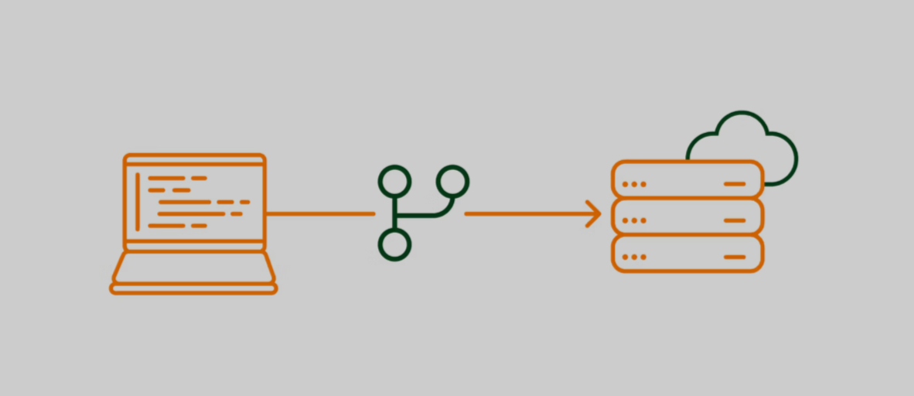
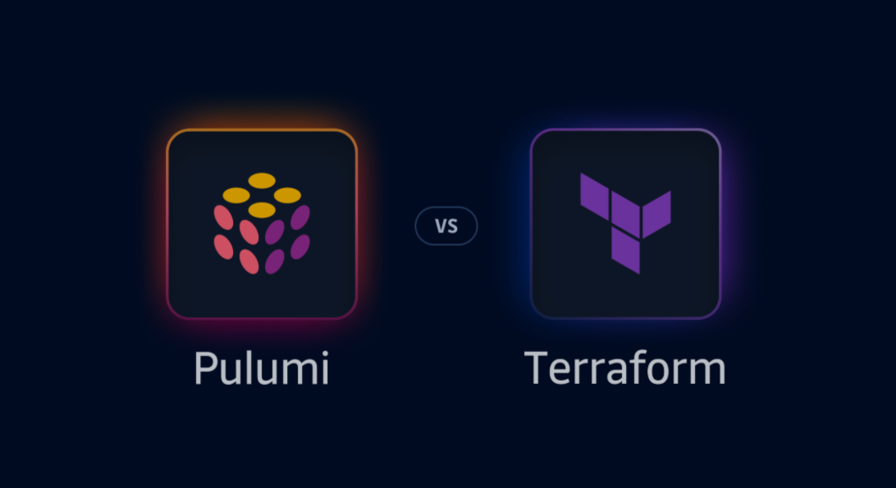

# Lesson: Deploying Cloud Resources Using Infrastructure as Code (IaC)

## Introduction

Infrastructure as Code (IaC) revolutionizes cloud resource management by enabling the definition, deployment, and updating of infrastructure through code (e.g., scripts or configuration files). Tools like Terraform and Pulumi automate provisioning, ensuring consistency, scalability, and cost efficiency while eliminating manual errors. This lesson explores IaC fundamentals, compares leading tools, and demonstrates practical implementation with Pulumi.


## 2. Learning Outcomes

By the end of this lesson, you will:

1. Understand IaC principles and its advantages over manual provisioning (consistency, version control, cost savings).
2. Compare Terraform (declarative/HCL) and Pulumi (imperative/general-purpose languages) for cloud automation.
3. Write Pulumi scripts to create and manage cloud resources (e.g., AWS S3 buckets).
4. Apply IaC best practices: modularity, testing, version control, and documentation.
5. Recognize IaC challenges, including state management and tool maturity.

---

## 1. What is Infrastructure as Code (IaC)?

Infrastructure as Code (IaC) is the practice of managing and provisioning cloud resources using code (e.g., scripts or configuration files) instead of manual processes. It allows you to define, deploy, and update infrastructure in a repeatable and automated way.





### Key Benefits:

- **Consistency:** Ensures that the same environment is created every time.
- **Version Control:** Infrastructure definitions can be stored in version control systems like Git.
- **Scalability:** Easily replicate environments across multiple regions or clouds.
- **Cost Efficiency:** Automates resource management, reducing human error and operational costs.

### How Does IaC Improve Cloud Resource Management?

- **Automation:** Reduces manual effort and human errors.
- **Consistency:** Ensures the same infrastructure is deployed every time.
- **Version Control:** Tracks changes to infrastructure over time.

### Advantages of IaC Over Manual Cloud Provisioning

- **Speed:** Deploy infrastructure in minutes instead of hours.
- **Scalability:** Easily replicate environments for testing or production.
- **Disaster Recovery:** Quickly rebuild infrastructure in case of failure.

### How IaC Works

1. **Define Infrastructure:** Write code (e.g., YAML, JSON, or a domain-specific language) to describe the desired state of your infrastructure.
2. **Apply Configuration:** Use an IaC tool (e.g., Terraform, Pulumi) to interpret the code and provision the resources in the cloud.
3. **Manage Changes:** Update the code to reflect changes in the infrastructure, and the tool will handle the updates automatically.

### Common IaC Tools

- **Terraform:** A widely used open-source tool that uses a declarative language (HCL) to define infrastructure.
- **Pulumi:** An IaC tool that allows you to write infrastructure code using general-purpose programming languages like Python, JavaScript, and Go.
- **AWS CloudFormation:** A native AWS service for defining and deploying AWS resources using JSON or YAML templates.
- **Azure Resource Manager (ARM):** A native Azure service for managing Azure resources using JSON templates.

---

## 2. Comparing Pulumi vs. Terraform for Cloud Automation





### Terraform

Terraform is an open-source IaC tool developed by HashiCorp. It uses a declarative language called HashiCorp Configuration Language (HCL) to define infrastructure.

#### Key Features:

- **Multi-Cloud Support:** Works with AWS, Azure, Google Cloud, and many other providers.
- **State Management:** Maintains a state file to track the current state of the infrastructure.
- **Modularity:** Supports reusable modules for common infrastructure patterns.

#### Pros:

- Large community and ecosystem.
- Well-documented and widely adopted.

#### Cons:

- Limited to HCL for defining infrastructure.
- State file management can be complex.

### Pulumi

Pulumi is an IaC tool that allows you to write infrastructure code using general-purpose programming languages like Python, JavaScript, TypeScript, and Go.

#### Key Features:

- **Language Flexibility:** Use familiar programming languages to define infrastructure.
- **Real Programming Constructs:** Leverage loops, conditionals, and functions.
- **State Management:** Similar to Terraform, Pulumi maintains a state file.

#### Pros:

- More expressive and flexible than Terraform.
- Easier to integrate with existing codebases and CI/CD pipelines.

#### Cons:

- Smaller community compared to Terraform.
- Less mature ecosystem.

### When to Use Terraform vs. Pulumi

- **Use Terraform if:**
  - You prefer a declarative approach.
  - You need multi-cloud support with a mature ecosystem.

- **Use Pulumi if:**
  - You want to use a general-purpose programming language.
  - You need more flexibility and expressiveness in your infrastructure code.

---

## 3. Writing Pulumi Scripts to Create Cloud Resources

### How to Set Up Pulumi for Cloud Resource Provisioning

1. Install Pulumi CLI.
2. Create a new Pulumi project:

```bash
pulumi new aws-typescript
```

3. Write your infrastructure code in the generated file.

### Basic Components of a Pulumi Script

- **Resources:** Define cloud resources (e.g., EC2, S3).
- **Outputs:** Export values for use in other parts of the script.
- **Configuration:** Store settings like region or instance size.

### Getting Started with Pulumi

1. **Install Pulumi:**
   Install the Pulumi CLI by following the instructions on the Pulumi website.
2. **Set Up a Project:**
   Create a new Pulumi project using the CLI:

```bash
pulumi new aws-typescript
```

3. **Configure Cloud Provider:**
   Set up your cloud provider credentials (e.g., AWS access keys) using environment variables or Pulumi configuration.

### Example: Create an S3 Bucket in AWS

```typescript
import * as pulumi from "@pulumi/pulumi";  
import * as aws from "@pulumi/aws";  

// Create an AWS S3 bucket  
const bucket = new aws.s3.Bucket("my-bucket", {  
    acl: "private",  
    tags: {  
        Environment: "Dev",  
    },  
});  

// Export the bucket name  
export const bucketName = bucket.id;
```

### Explanation:

- The script imports the necessary Pulumi and AWS modules.
- It creates an S3 bucket with a private ACL and a tag.
- The bucket name is exported for reference.

---

## Best Practices for IaC

1. **Version Control:**
   Store your IaC code in a version control system like Git to track changes and collaborate with others.
2. **Modularity:**
   Break down your infrastructure into reusable modules or components.
3. **Testing:**
   Use tools like `pulumi preview` and automated tests to validate your infrastructure code.
4. **Documentation:**
   Document your infrastructure code to make it easier for others to understand and use.

### Challenges in IaC

1. **Learning Curve:**
   IaC tools and practices can have a steep learning curve, especially for beginners.
2. **State Management:**
   Managing state files (e.g., Terraform state or Pulumi state) can be complex and requires careful handling.
3. **Tool Maturity:**
   Some IaC tools may lack certain features or have limited support for specific cloud providers.

---

## Conclusion

IaC transforms infrastructure management by codifying cloud resources, enabling repeatable and scalable deployments. Whether using Terraform’s declarative approach or Pulumi’s programming flexibility, teams gain agility and reliability. By adopting best practices—like version control and modular design—and addressing challenges such as state management, IaC empowers efficient, error-resistant cloud operations.
